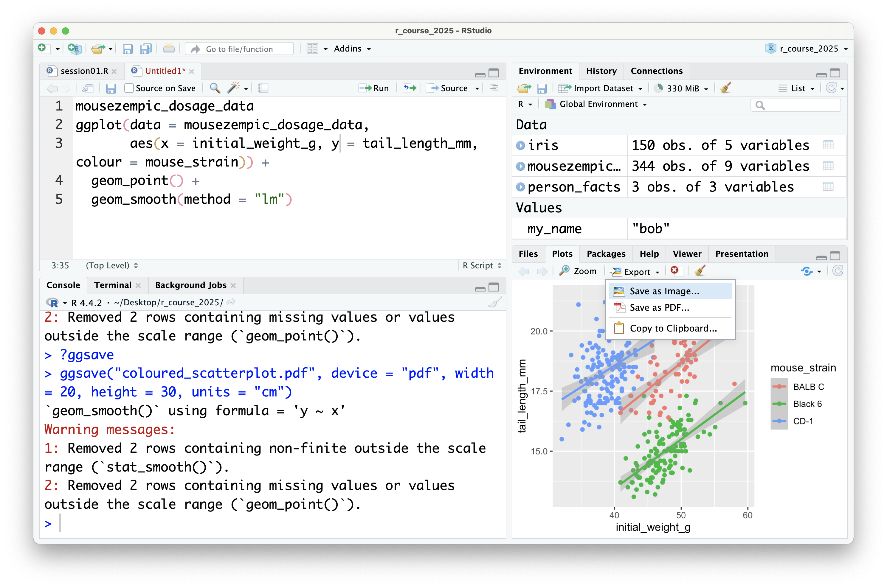
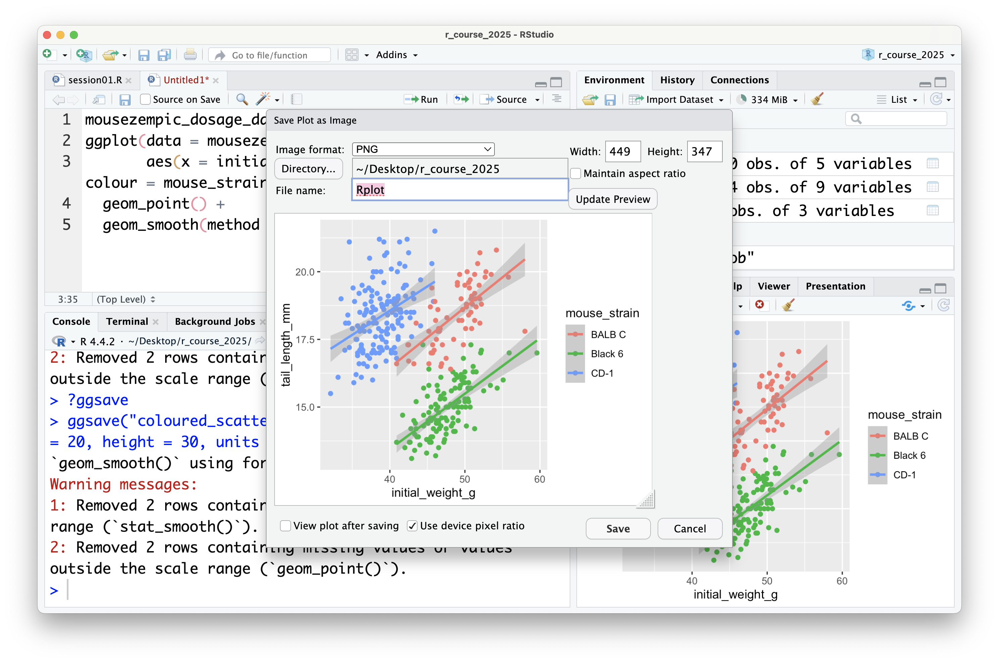
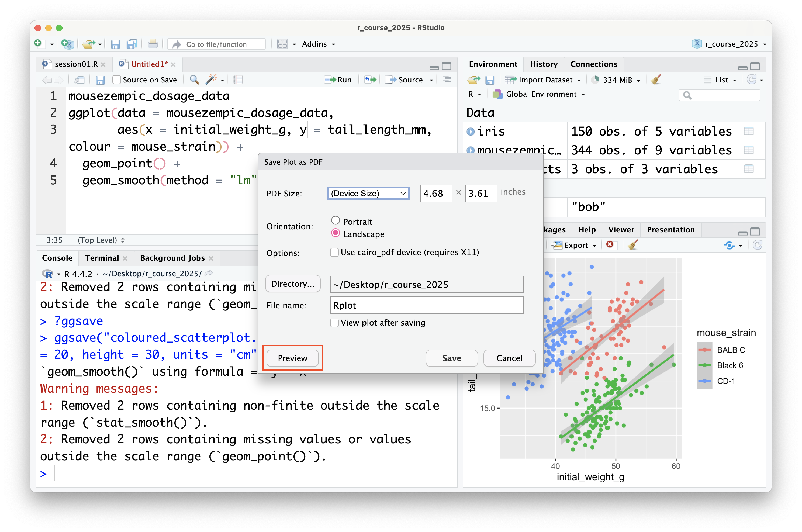
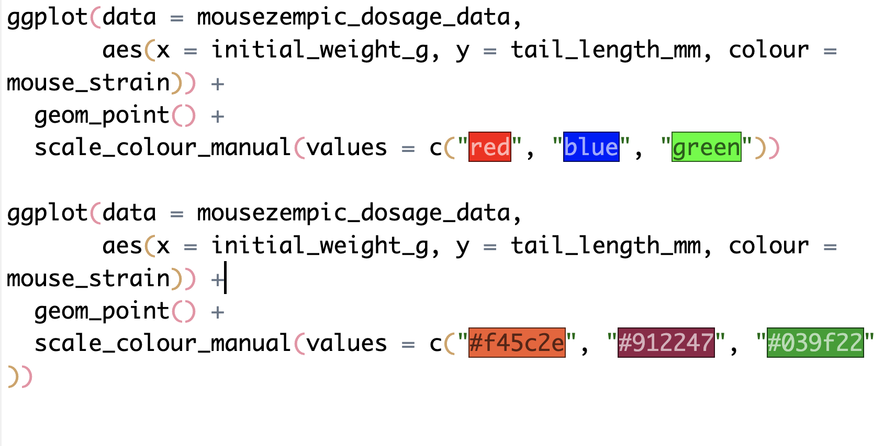

---
filters:
  - naquiz
format:
  html:
    toc: true
    toc-location: left
    toc-title: "In this chapter:"
---


# Chapter 3: Plotting with ggplot2 {#sec-chapter03}

In this chapter we will learn how to create and customise plots using the `ggplot2` package.

::: {.callout-tip title="Learning Objectives"}
At the end of this chapter, learners should be able to:

1.  Create a ggplot and save it for use outside of R
2.  Describe some of the common ways we can change the appearance of a plot, such as themes, legends and colours.
3.  List some of the common geoms available in ggplot2 and what types of data they might be useful for
4.  Use the `facet_wrap` function to create a series of similar plots
5.  Understand how to use the `patchwork` package to compose multiple plots together into a single figure
:::

To get started, let's load the `tidyverse` package, which includes `ggplot2`:


::: {.cell}

```{.r .cell-code}
library(tidyverse)
```

::: {.cell-output .cell-output-stderr}

```
── Attaching core tidyverse packages ──────────────────────── tidyverse 2.0.0 ──
✔ dplyr     1.1.4     ✔ readr     2.1.5
✔ forcats   1.0.0     ✔ stringr   1.5.1
✔ ggplot2   3.5.1     ✔ tibble    3.2.1
✔ lubridate 1.9.3     ✔ tidyr     1.3.1
✔ purrr     1.0.2     
── Conflicts ────────────────────────────────────────── tidyverse_conflicts() ──
✖ dplyr::filter() masks stats::filter()
✖ dplyr::lag()    masks stats::lag()
ℹ Use the conflicted package (<http://conflicted.r-lib.org/>) to force all conflicts to become errors
```


:::
:::


And read in the `m_dose` that we have been using in previous chapters:


::: {.cell}

```{.r .cell-code}
m_dose <- read_csv("data/mousezempic_dosage_data.csv")
```

::: {.cell-output .cell-output-stderr}

```
Rows: 344 Columns: 9
── Column specification ────────────────────────────────────────────────────────
Delimiter: ","
chr (4): mouse_strain, cage_number, replicate, sex
dbl (5): weight_lost_g, drug_dose_g, tail_length_mm, initial_weight_g, id_num

ℹ Use `spec()` to retrieve the full column specification for this data.
ℹ Specify the column types or set `show_col_types = FALSE` to quiet this message.
```


:::
:::


## Building our first plot, layer by layer

Although R has a built-in plotting system, `ggplot2` is a more powerful and flexible package for creating plots. The `gg` in `ggplot2` stands for "Grammar of Graphics", which is a way thinking about how each component of a plot (e.g. axes or colours) is part of the 'language' of data visualisation that allows you to compose complex plots piece by piece, just like you combine words to form sentences.

### Initialisation

When making a ggplot, the first thing you need to do is initialise it with the `ggplot()` function. This function takes two arguments:

-   the **data** that you want to visualise (a dataframe/tibble), and
-   **mapping**, which describes the scales that will be used to display the data (e.g. which variable should be the x axis, which should be represented by colour, etc.)

The mapping is specified using the `aes()` function, which stands for 'aesthetics'. It takes named arguments, where the names are the aesthetics you want to use to show your data (e.g. `x`, `y`, `colour`, `shape`, etc.) and the values are the names of the columns in your data that you want to use for those aesthetics.

For example, to make a plot to explore the relationship between the initial weight of the mice and their tail length, we would write:


::: {.cell}

```{.r .cell-code}
m_dose %>% ggplot(aes(x = initial_weight_g, y = tail_length_mm))
```

::: {.cell-output-display}
{width=2000}
:::
:::


In the plot panel (bottom right hand corner), you should now see a blank plot with the x and y axes labelled with the column names we specified in the `aes()` function. There's no data on it yet, because we haven't told ggplot how to physically represent the data on the x and y scales we have specified.

### Adding data

Data is represented in ggplot using **geoms** (short for 'geometric objects'). A geom is a visual representation of the data in the plot, such as points, lines or bars. They are named `geom_*` where `*` is the type of geom you want to use. We will cover some of the most common geoms later in this chapter.

Geoms are added to plots layers (which are drawn on top of one another, like layers of a cake) using the `+` operator.

For example, let's add points to the plot that we initialised above using `geom_point()`:


::: {.cell}

```{.r .cell-code}
m_dose %>% ggplot(aes(x = initial_weight_g, y = tail_length_mm)) +
  geom_point()
```

::: {.cell-output .cell-output-stderr}

```
Warning: Removed 2 rows containing missing values or values outside the scale range
(`geom_point()`).
```


:::

::: {.cell-output-display}
{width=2000}
:::
:::


This gives us a basic scatterplot of the data, with each point representing the tail length and initial weight of a mouse in our dataset.

Notice how we didn't have to specify the data or mapping again when we added the `geom_point()` layer, because the data and mapping are inherited from the initial `ggplot()` function call. This is a common pattern in ggplot2: you only need to specify the data and mapping once, and it is used by all subsequent layers.

::: {.callout-note title="The plus `+` vs the pipe `%>%`"}
You might have noticed that `+` in ggplot works similarly to the pipe operator `%>%` in the `dplyr` package in that you place it at the end of a line of code, but **`+` is only ever used in the context of plotting.**

Don't mix them up! A handy way to remember is that `+` looks a bit like the axes of a plot, so it's what you should use when plotting.
:::

### Overlaying additional data

Of course, this is a very simple plot. To show more information, we can add additional layers using the `+` operator, or use additional aesthetics.

For example, let's add a a layer containing a linear trendline using `geom_smooth(method = "lm")`:


::: {.cell}

```{.r .cell-code}
m_dose %>% ggplot(aes(x = initial_weight_g, y = tail_length_mm)) +
  geom_point() +
  geom_smooth(method = "lm")
```

::: {.cell-output .cell-output-stderr}

```
`geom_smooth()` using formula = 'y ~ x'
```


:::

::: {.cell-output .cell-output-stderr}

```
Warning: Removed 2 rows containing non-finite outside the scale range
(`stat_smooth()`).
```


:::

::: {.cell-output .cell-output-stderr}

```
Warning: Removed 2 rows containing missing values or values outside the scale range
(`geom_point()`).
```


:::

::: {.cell-output-display}
{width=2000}
:::
:::


Here, we supplied the `method = "lm"` argument to `geom_smooth()` to tell it fit a linear model (lm for short) to the data and plot the line of best fit, surrounded by a 95% confidence interval. Most geoms will have additional arguments like this that you can use to customise their appearance. Remember that we can check the documentation for geoms and other functions using `?geom_smooth`.

::: {.callout-note title="ggplot2 and missing values"}
You might have noticed that, along with the plot, R is also printing a warning message that lets us know that some rows of our data contain missing values. ggplot2 will automatically remove these rows from the plot (and warn you that it's happening), but it's always a good idea to check your data for missing values before plotting it, as they can affect the results of your analysis. Recall from last chapter that we can do this by combining the `is.na()` function with `filter()`:


::: {.cell}

```{.r .cell-code}
# find the rows of our data that contain missing values in the columns we're plotting
m_dose %>%
  filter(is.na(initial_weight_g), is.na(tail_length_mm))
```

::: {.cell-output .cell-output-stdout}

```
# A tibble: 2 × 9
  mouse_strain cage_number weight_lost_g replicate sex   drug_dose_g
  <chr>        <chr>               <dbl> <chr>     <chr>       <dbl>
1 CD-1         1A                     NA rep1      <NA>           NA
2 Black 6      3E                     NA rep3      <NA>           NA
# ℹ 3 more variables: tail_length_mm <dbl>, initial_weight_g <dbl>,
#   id_num <dbl>
```


:::
:::


From here on, we will hide these warnings in the ebook so that it's easier to read, but you'll still see them if you run the code in your own R session.
:::

We can also add additional aesthetics to the plot beyond just `x` and `y`. For example, let's use the `colour` aesthetic to represent the strain of each mouse. To do this, we add `colour = strain` to the `aes()` function that describes the mapping in the `ggplot()` call:


::: {.cell}

```{.r .cell-code}
m_dose %>% ggplot(
  aes(x = initial_weight_g, y = tail_length_mm, colour = mouse_strain)) +
  geom_point() +
  geom_smooth(method = "lm")
```

::: {.cell-output .cell-output-stderr}

```
`geom_smooth()` using formula = 'y ~ x'
```


:::

::: {.cell-output .cell-output-stderr}

```
Warning: Removed 2 rows containing non-finite outside the scale range
(`stat_smooth()`).
```


:::

::: {.cell-output .cell-output-stderr}

```
Warning: Removed 2 rows containing missing values or values outside the scale range
(`geom_point()`).
```


:::

::: {.cell-output-display}
{width=2000}
:::
:::


Not only are the points now coloured by the strain of each mouse, but there are now three separate colour-coded trendlines, one for each strain. This is because the aesthetic mapping we supply to the `ggplot()` function when initialising the plot is inherited by **all** subsequent layers/geoms.

Notice as well how adding colour to the plot totally changes the way we perceive the data! Without colour and just plotting a single trendline, it appeared that there was an overall negative association between initial weight and tail length, but we can now see that there is actually a positive association within each strain. This is an example of [Simpson's Paradox](https://en.wikipedia.org/wiki/Simpson%27s_paradox), and shows why it's so important to visualise your data!

### Saving plots as images

Once you're satisfied with the plot you've created, you can programmatically save your plot using the `ggsave()` function.

To use `ggsave()`, you need to specify:

-   The name of the file to to save the plot as (e.g. `"my_plot.png"`). Specifying a different file extension, e.g. `"my_plot.pdf"` will save the plot in the appropriate format.
-   The plot object you want to save (defaults to the last plot you sent to the plot pane).
-   The dimensions of the plot (e.g. `width = 6, height = 4`). Dimensions are in inches by default and can be changed using the `units` argument (e.g. `units = "cm"`).

For example, to save the last plot we created as a .png file with dimensions of 5 by 7 inches, we would write:


::: {.cell}

```{.r .cell-code}
ggsave("coloured_scatterplot.png", device = "png", width = 5, height = 7)
```
:::


Or to save it as a .pdf file with dimensions of 20 by 30 cm:


::: {.cell}

```{.r .cell-code}
ggsave("coloured_scatterplot.pdf", device = "pdf", width = 20, height = 30, units = "cm")
```
:::


It's good practice to assign the plot you want to save to a variable, and provide it to the 'plot' argument of `ggsave()`, rather than relying on the last plot you created. This makes it clear what plot you're saving, so that your code is more readable and reproducible.


::: {.cell}

```{.r .cell-code}
# first assign the plot to a variable
colourful_scatterplot <- m_dose %>% ggplot(
  aes(x = initial_weight_g, y = tail_length_mm, colour = mouse_strain)) +
  geom_point() +
  geom_smooth(method = "lm")

# then save the plot: notice the 'plot' argument
ggsave("coloured_scatterplot.pdf", plot = colourful_scatterplot, device = "pdf", width = 20, height = 30, units = "cm")
```
:::


It's also possible to save plots using the export button in the plot panel: 

You can choose to save the plot either as an image: 

In this case, you can set the file type and dimensions, and see a preview of the plot before saving it. Tip: it's also possible to change the dimensions of the plot by dragging the bottom left of the preview window.

You can also save plots as a PDF: 

Although there is no preview for PDFs within RStudio itself, you can click the 'preview' button to open the PDF in your default PDF viewer.

In general, it's preferable to save plots programmatically using `ggsave()` because it's more reproducible (because if you ever change your plotting code or data, new plot files can be automatically generated), but the export button can be useful for quickly saving plots during exploratory data analysis (or use the ultimate lazy hack: just screenshot the plot panel!).

::: {.callout-important title="Practice exercises"}
Try these practice questions to test your understanding

::: question
1\. Which of the following statements about the mapping in a ggplot is **incorrect**?

::: choices
::: choice
Mapping is specified using the `aes()` function
:::

::: {.choice .correct-choice}
Mapping refers to the type of plot you want to create (e.g. scatterplot, line plot)
:::

::: choice
When you specify the mapping in the `ggplot()` function, it is inherited by all subsequent layers/geoms
:::

::: choice
Mapping allows you to specify which scales (e.g. x, y, colour) should be used to display the data
:::
:::
:::

::: question
2\. Which of the following lines of code is a valid way to create a scatterplot of the drug dosage (x) and weight loss (y) in the `m_dose` dataset?

::: choices
::: choice
`m_dose %>% ggplot(aes(x = drug_dose_g, y = weight_lost_g)) %>% geom_point()`
:::

::: choice
`m_dose %>% ggplot(x = drug_dose_g, y = weight_lost_g) + geom_point()`
:::

::: choice
`m_dose %>% ggplot2(aes(x = drug_dose_g, y = weight_lost_g))`
:::

::: {.choice .correct-choice}
`m_dose %>% ggplot(aes(x = drug_dose_g, y = weight_lost_g)) + geom_point()`
:::
:::
:::

::: question

3. How could you programmatically save the plot created in question 2 as a .pdf file with dimensions of 10 by 15 cm?

::: choices
::: {.choice .correct-choice}
`ggsave("drug_dosage_vs_weight_loss.pdf", device = "pdf", width = 10, height = 15, units = "cm")`
:::

::: choice
`save("drug_dosage_vs_weight_loss.pdf", device = "pdf", width = 10, height = 15, units = "cm")`
:::

::: choice
`ggsave("drug_dosage_vs_weight_loss.pdf", device = "pdf", width = 10, height = 15)`
:::

::: choice
`ggsave("drug_dosage_vs_weight_loss.pdf", width = 10, height = 15)`
:::
:::
:::

<details>

<summary>Solutions</summary>

1.  Mapping in ggplot refers to the scales that will be used to display the data (e.g. x, y, colour), not the type of plot you want to create. It is specified using the `aes()` function, and when specified in the initial `ggplot()` function call, is inherited by all subsequent layers/geoms.
2.  The correct way to create a scatterplot of the drug dosage and weight loss in the `m_dose` dataset is `m_dose %>% ggplot(aes(x = drug_dose_g, y = weight_lost_g)) + geom_point()`. This speci_point()`. This specifies the data and mapping in the `ggplot()` function call, and adds a layer of points to the plot using `geom_point()`. The `%>%` operator is not used in ggplot2, and the `x` and `y` mapping should be specified within the `aes()` function. Also, remember that although ggplot2 is the name of the package, the function you use to initialise a plot is `ggplot()`.
3.  To programmatically save the plot created in question 2 as a .pdf file with dimensions of 10 by 15 cm, you would use the `ggsave()` function with the arguments `ggsave("drug_dosage_vs_weight_loss.pdf", device = "pdf", width = 10, height = 15, units = "cm")`. This specifies the filename, file type, dimensions, and units of the plot you want to save. Remember that by default, dimensions are in inches (boooo), so you need to specify the units as "cm" to save the plot with dimensions in centimetres.

</details>

:::

## Some commonly used geoms

ggplot2 has (as of writing) almost 50 different geoms that you can use to represent your data. You can see the full list in the [ggplot2 documentation](https://ggplot2.tidyverse.org/reference/#geoms), but some of the most commonly used geoms include:

-   `geom_point()` for visualising individual data points
-   `geom_density()` and `geom_histogram()` for visualising the distribution of a continuous variable
-   `geom_violin()` and `geom_boxplot()` for visualising the distribution of a continuous variable **across different categories**
-   `geom_bar()` and `geom_col()` for making bar plots
-   `geom_h/vline()` for adding horizontal and vertical lines to a plot

In this section, we will briefly cover these geoms and how you might use them to visualise your data. It's not designed to be an exhaustive list, but hopefully it will help you get started with some of the most common types of plots you might want to create.

::: {.callout-note title="How do I make a ... plot in ggplot2?"}
Often, you might come across a specific type of plot you want to make that is a bit more complex than the basic geoms we've covered here. If you know the name of the plot you're wanting to make, you can often find a tutorial/guide online by googling, or you could ask an AI assistant like ChatGPT. Particularly for specific types of data (e.g. clinical data, phylogenetic data), there are often field-specific packages that provide geoms or functions to make particular types of plots, like the [ggtree package](https://yulab-smu.top/treedata-book/index.html) for phylogenetic trees or the [survminer package](https://rpkgs.datanovia.com/survminer/) for survival plots.

If the plot doesn't have a specifc name, you can try to break it down by thinking about the geoms you might need to use to represent the data, or try uploading a picture of a similar plot to ChatGPT.

Whatever method you use, remember to add 'ggplot2' to your search query to get the most relevant results, as there are many different plotting packages in R!
:::

### Visualising individual data points: geom_point

Above, we saw how to use `geom_point()` to create a scatterplot, but `geom_point()` can be used in other ways too. For example, you can use it to create a dot plot, where the x axis is categorical and the y axis is continuous:


::: {.cell}

```{.r .cell-code}
# make a dot plot of initial weight by mouse strain
m_dose %>% ggplot(aes(x = mouse_strain, y = initial_weight_g)) +
# remember we add layers to a plot with +
  geom_point()
```

::: {.cell-output-display}
{width=2000}
:::
:::


Notice how the points are stacked on top of one another for each strain. This is because the x axis is categorical, and ggplot2 doesn't know how to spread the points out. This can make it difficult to see the individual points (known as 'overplotting'), so when making a plot like this it's often better to use `geom_jitter()`:


::: {.cell}

```{.r .cell-code}
# make a jittered dot plot of initial weight by mouse strain
m_dose %>% ggplot(aes(x = mouse_strain, y = initial_weight_g)) +
  geom_jitter()
```

::: {.cell-output-display}
{width=2000}
:::
:::


The `geom_jitter()` adds a small amount of random noise to the x & y positions of each point, which helps to spread them out and make it easier to see the individual points. Like most functions in ggplot2, `geom_jitter()` will try to guess an appropriate amount of jitter to add, but you can specify the amount as well:


::: {.cell}

```{.r .cell-code}
# use less jitter so there is more distinction between the different mouse strains
m_dose %>% ggplot(aes(x = mouse_strain, y = initial_weight_g)) +
  geom_jitter(width = 0.2, height = 0)
```

::: {.cell-output-display}
{width=2000}
:::
:::


The exact amount of jitter you need will depend heavily on your data, so it's often a good idea to experiment with different amounts to see what works best.

::: {.callout-note title="Beeswarm plots"}
Another way to spread out points in a dot plot is to use a beeswarm plot, in which points are spread out slightly along the x axis so that they don't overlap. The `ggbeeswarm` package provides a `geom_beeswarm()` function that you can use to create beeswarm plots in ggplot2 (rather than using `geom_jitter()` like we did here). For more information, see the [ggbeeswarm documentation](https://github.com/eclarke/ggbeeswarm/blob/main/README.md).
:::

Beyond just scatterplots and dot plots, `geom_point()` is also really useful to overlay additional data on top of other geoms. For example, you can use it to add individual data points to a boxplot or violin plot, as we will see shortly!

### Visualising the distribution of a continuous variable: geom_histogram / geom_density
As the number of data points increases, it can be difficult to see individual points. In this case, it can be useful to visualise the distribution of a continuous variable using a histogram or density plot.

Histograms are created using the `geom_histogram()` function. Seeing as only a single variable is being plotted, you only need to specify the `x` aesthetic in the `aes()` function.

For example, let's create a histogram of the initial weight of the mice:


::: {.cell}

```{.r .cell-code}
m_dose %>% ggplot(aes(x = initial_weight_g)) +
  geom_histogram()
```

::: {.cell-output-display}
{width=2000}
:::
:::


One of the most important arguments to `geom_histogram()` is the `bins` argument, which specifies the number of bins (bars) to use for the histogram. By default, it is 30, but you might want a smaller or larger value depending on the distribution of your data. For example, let's create a histogram with 15 bins:


::: {.cell}

```{.r .cell-code}
m_dose %>% ggplot(aes(x = initial_weight_g)) +
  geom_histogram(bins = 15)
```

::: {.cell-output-display}
{width=2000}
:::
:::


Similarly to histograms, density plots are also used to visualise the distribution of a continuous variable, but they are smoothed out. To create a density plot in ggplot2, you can use the `geom_density()` function:


::: {.cell}

```{.r .cell-code}
m_dose %>% ggplot(aes(x = initial_weight_g)) +
  geom_density()
```

::: {.cell-output-display}
{width=2000}
:::
:::


Notice how the density plot is smoothed out compared to the histogram, and it is also scaled so that the area under the curve is equal to 1. This means that the y axis of a density plot represents the probability density of the data, rather than the count of data points in each bin.

### Visualising the distribution of a continuous variable across categories: geom_boxplot / geom_violin
Often in biological data, you will want to visualise the distribution of a continuous variable across different categories. For example, we might want to see how the initial weight of the mice varies by strain. Two plot types that are useful for this are boxplots and violin plots.

Boxplots allow you to easily see the median, quartiles, and any outliers in the data. To create a boxplot win ggplot2, you can use the `geom_boxplot()` function:


::: {.cell}

```{.r .cell-code}
m_dose %>% ggplot(aes(x = mouse_strain, y = initial_weight_g)) +
  geom_boxplot()
```

::: {.cell-output-display}
{width=2000}
:::
:::


It can sometimes be nice to add points to a boxplot to show the individual data points as well as the summary statistics. You can do this by adding a `geom_point()` or `geom_jitter()` layer to the plot:


::: {.cell}

```{.r .cell-code}
m_dose %>% ggplot(aes(x = mouse_strain, y = initial_weight_g)) +
  geom_boxplot() +
  geom_jitter(width = 0.2)
```

::: {.cell-output-display}
{width=2000}
:::
:::


This plot shows the distribution of initial weight for each strain (with the boxplot), as well as the individual data points. Notice how the points are jittered to avoid overlapping, as we did earlier with the dot plot.

However, when you have a lot of data points (as we do here), a boxplot with overlaid points can be a bit messy and hard to read. In this case, it might be better to use a violin plot instead, which shows the distribution of the data as a density plot:


::: {.cell}

```{.r .cell-code}
m_dose %>% ggplot(aes(x = mouse_strain, y = initial_weight_g)) +
  geom_violin()
```

::: {.cell-output-display}
{width=2000}
:::
:::


You can even combine `geom_violin()` with `geom_boxplot()` to show both the distribution of the data and the summary statistics:


::: {.cell}

```{.r .cell-code}
m_dose %>% ggplot(aes(x = mouse_strain, y = initial_weight_g)) +
  geom_violin() +
  geom_boxplot(width = 0.1)
```

::: {.cell-output-display}
{width=2000}
:::
:::


Notice how we specified the `width` argument in `geom_boxplot()` to make the boxplot narrower, so that it doesn't obscure the violin plot.

### geom_bar / geom_col
The last pair of basic geoms we'll cover are `geom_bar()` and `geom_col()`, which are used to create bar plots. These are handy for visualising categorical data, such as the number of mice in each strain or the average weight loss for each dosage.

`geom_bar()` is used to create bar plots from counts of categorical data, while `geom_col()` is used to create bar plots from pre-computed values. This means that if you have already calculated the counts or averages for each category, you should use `geom_col()` instead of `geom_bar()`.

For example, if we wanted to create a bar plot of the number of mice in each strain with `geom_col()`, we would first need to calculate the counts for each strain:


::: {.cell}

```{.r .cell-code}
# first count the number of mice per strain
m_counts <- m_dose %>%
  group_by(mouse_strain) %>%
  summarise(count = n())

# then create the bar plot
m_counts %>% ggplot(  aes(x = mouse_strain, y = count) ) +
  geom_col()
```

::: {.cell-output-display}
{width=2000}
:::
:::


Whereas if we used `geom_bar()`, we would not need to calculate the counts first:


::: {.cell}

```{.r .cell-code}
m_dose %>% ggplot(
  aes(x = mouse_strain)) +
  geom_bar()
```

::: {.cell-output-display}
{width=2000}
:::
:::


Notice how we only specified the `x` aesthetic in the `aes()` function, and `geom_bar()` automatically calculated the counts for each strain.

The advantage of using `geom_bar()` is that it is simpler and easier to read for plotting counts, but it can't be used for plotting pre-computed values. For example, if you wanted to plot the average weight loss for each strain, you would need to calculate the averages first with the dplyr functions we learned in @sec-chapter02 and use `geom_col()`:


::: {.cell}

```{.r .cell-code}
# first calculate the average weight loss for each strain
avg_weight_loss <- m_dose %>%
  group_by(mouse_strain) %>%
  summarise(avg_weight_loss = mean(weight_lost_g))

# then create the bar plot
avg_weight_loss %>% ggplot( aes(x = mouse_strain, y = avg_weight_loss)) +
  geom_col()
```

::: {.cell-output .cell-output-stderr}

```
Warning: Removed 2 rows containing missing values or values outside the scale range
(`geom_col()`).
```


:::

::: {.cell-output-display}
{width=2000}
:::
:::


<!-- ### geom_line
Idk how useful geom_line is ? i feel like i use density more often
As the name suggests, `geom_line()` is used to create line plots. These are useful for showing trends over time or across a continuous variable. Since we don't have a time variable in our dataset, let's use the `drug_dosage` variable to show how weight loss changes with increasing dosage:


::: {.cell}

```{.r .cell-code}
m_dose %>% ggplot(aes(x = drug_dose_g, y = weight_lost_g)) +
  geom_line()
```

::: {.cell-output-display}
{width=2000}
:::
:::


(In reality the relationship between these variables is probably better represented as points on a scatterplot rather than as a line, but this is just an example of how you can use `geom_line()`).

It's also possible to combine `geom_line()` with `geom_point()` to show the individual data points as well as the connection between them:


::: {.cell}

```{.r .cell-code}
m_dose %>% ggplot(aes(x = drug_dose_g, y = weight_lost_g)) +
  geom_line() +
  geom_point()
```

::: {.cell-output-display}
{width=2000}
:::
:::


 -->
### geom_hline / geom_vline
The `geom_hline()` and `geom_vline()` functions are used to add horizontal and vertical lines to a plot, respectively. Although you'll probably never use them alone, they are great to add to your plots to highlight specific values or thresholds in your data. To use them, you need to specify the `yintercept` (for `geom_hline()`) or `xintercept` (for `geom_vline()`) argument, which specifies where to draw the line.

For example, let's add a horizontal line to our scatterplot of drug dosage and weight loss at the 4g mark, which might represent a clinically significant amount of weight loss:


::: {.cell}

```{.r .cell-code}
m_dose %>% ggplot(aes(x = drug_dose_g, y = weight_lost_g)) +
  geom_point() +
  geom_hline(yintercept = 4)
```

::: {.cell-output-display}
{width=2000}
:::
:::


We could also add a vertical line at the 0.0025g mark to show the theorectical maximum dosage of the drug:


::: {.cell}

```{.r .cell-code}
m_dose %>% ggplot(aes(x = drug_dose_g, y = weight_lost_g)) +
  geom_point() +
  geom_hline(yintercept = 4) +
  geom_vline(xintercept = 0.0025)
```

::: {.cell-output-display}
{width=2000}
:::
:::


Notice how adding this line extends the x axis to include 0.0025, even though there are no data points at that value. This is because, by default, ggplot2 chooses axes limits for you that include all the data and any additional layers you add to the plot.

::: {.callout-important title="Practice exercises"}
Try these practice questions to test your understanding

::: question
1\. Which geom could you use to create a boxplot?

::: choices
::: {.choice .correct-choice}
`geom_boxplot()`
:::

::: choice
`geom_box()`
:::

::: choice
`geom_col()`
:::

::: choice
`geom_violin()`
:::
:::
:::

::: question
2\. Which of the following lines of code is a valid way to create a violin plot of the tail length of the mice by strain, with points overlaid?

::: choices
::: choice
`m_dose %>% ggplot(aes(x = mouse_strain, y = tail_length_mm)) + geom_violin(geom_jitter(width = 0.2)) `
:::

::: choice
`m_dose %>% ggplot(aes(x = mouse_strain, y = tail_length_mm)) + geom_jitter(width = 0.2)`
:::

::: choice
`m_dose %>% ggplot(aes(x = mouse_strain, y = tail_length_mm)) + geom_violin()`
:::

::: {.choice .correct-choice}
`m_dose %>% ggplot(aes(x = mouse_strain, y = tail_length_mm)) + geom_violin() + geom_jitter(width = 0.2)`
:::
:::
:::

::: question

3. What does this code do?


::: {.cell}

```{.r .cell-code}
m_dose %>% ggplot(aes(x = cage_number)) +
  geom_bar() +
  geom_hline(yintercept = 60)
```
:::


::: choices
::: choice
Makes a box plot of the number of mice in each cage, with a horizontal line at 60.
:::

::: choice
Makes a bar plot of the number of cages in the dataset, with a horizontal line at 60.
:::

::: {.choice .correct-choice}
Makes a bar plot of the number of mice in each cage, with a horizontal line at 60.
:::

::: choice
Makes a bar plot of the number of mice in each cage
:::
:::
:::

<details>

<summary>Solutions</summary>

1.  The correct answer is `geom_boxplot()`. This is the function used to create boxplots in ggplot2.
2.  The correct way to create a violin plot of the tail length of the mice by strain, with points overlaid, is `m_dose %>% ggplot(aes(x = mouse_strain, y = tail_length_mm)) + geom_violin() + geom_jitter(width = 0.2)`. This specifies the data and mapping in the `ggplot()` function call, adds a layer of violin plots using `geom_violin()`, and then adds a layer of points using `geom_jitter()` to avoid overlapping.
3.  The code creates a bar plot of the number of mice in each cage, with a horizontal line at 60. The `geom_bar()` function counts the number of mice in each cage and plots the counts as bars, while the `geom_hline()` function adds a horizontal line at the y value of 60. This could be used to show a threshold e.g. for the maximum number of mice allowed in a cage.

</details>

:::

## Aesthetics and scales
Now that we've learned some of the common geoms we can use to physically represent our data, let's discuss the aesthetics that govern how these geoms look and the scales that map our data to these aesthetics.

### Aesthetics
As described earlier, aesthetics are the visual properties of the geoms that we can control, such as colour, position, size and shape. We saw how the `colour` aesthetic could be used in all layers of the plot to show the strain of each mouse, by specifying `colour = mouse_strain` in the `aes()` function:


::: {.cell}

```{.r .cell-code}
m_dose %>% ggplot(
  aes(x = initial_weight_g, y = tail_length_mm, colour = mouse_strain)) +
  geom_point() +
  geom_smooth(method = "lm")
```

::: {.cell-output .cell-output-stderr}

```
`geom_smooth()` using formula = 'y ~ x'
```


:::

::: {.cell-output .cell-output-stderr}

```
Warning: Removed 2 rows containing non-finite outside the scale range
(`stat_smooth()`).
```


:::

::: {.cell-output .cell-output-stderr}

```
Warning: Removed 2 rows containing missing values or values outside the scale range
(`geom_point()`).
```


:::

::: {.cell-output-display}
{width=2000}
:::
:::


It's also possible to specify aesthetics for specific geoms, rather than for the whole plot. For example, let's say we wanted to colour the points by mouse strain, but just have a single trendline for all of the data (rather than one for each strain, like we have above). We could do this by specifying the `colour` aesthetic in the `geom_point()` layer, rather than in the `ggplot()` function:


::: {.cell}

```{.r .cell-code}
m_dose %>% ggplot(
  aes(x = initial_weight_g, y = tail_length_mm)) +
  geom_point(aes(colour = mouse_strain)) +
  geom_smooth(method = "lm")
```

::: {.cell-output-display}
{width=2000}
:::
:::


This allows us to have different aesthetics for different layers of the plot, giving us the power to create some really complex visualisations.

Different geoms can accept different aesthetics. For example, let's try using the `colour` aesthetic to colour a boxplot of tail length by mouse strain:


::: {.cell}

```{.r .cell-code}
m_dose %>% ggplot(
  aes(x = mouse_strain, y = tail_length_mm, colour = mouse_strain)) +
  geom_boxplot()
```

::: {.cell-output-display}
{width=2000}
:::
:::


Notice how the outline of the boxplot is coloured by strain, but the fill is not. For geoms that show an area of some sort (like boxplots, histograms, violin plots or bar charts), they have both a `colour` aesthetic that controls the colour of the outline of the shape, and a `fill` aesthetic that controls the fill colour. So if we wanted the boxplot to be filled with the colour of the strain, we should use the `fill` aesthetic instead:


::: {.cell}

```{.r .cell-code}
m_dose %>% ggplot(
  aes(x = mouse_strain, y = tail_length_mm, fill = mouse_strain)) +
  geom_boxplot()
```

::: {.cell-output-display}
{width=2000}
:::
:::


You can see all of the aesthetics that a geom accepts by checking its help page (e.g. `?geom_boxplot`) and reading the "Aesthetics" section.

### Combining multiple aesthetics
Notice how in the last example, we used mapped the same variable (`mouse_strain`) to both the `x` and `fill` aesthetics. It's often helpful to show the same variable through multiple aesthetics, as it can convey the information more clearly. As another example, for the scatterplot example we used earlier, we could also use the `shape` aesthetic to show the strain of each mouse:


::: {.cell}

```{.r .cell-code}
m_dose %>% ggplot(
  aes(x = initial_weight_g, y = tail_length_mm, colour = mouse_strain, shape = mouse_strain)) +
  geom_point()
```

::: {.cell-output-display}
{width=2000}
:::
:::


Now we can see the strain of each mouse through both colour and shape, which makes it even easier to distinguish between the different strains.

Of course, we may instead want to use aesthetics to add additional variables to our visualisation. To illustrate this, let's make a scatterplot that visualises the initial weight and tail length of each mouse, but also shows the drug dosage, cage number and mouse strain:


::: {.cell}

```{.r .cell-code}
m_dose %>% ggplot(
  aes(x = initial_weight_g, y = tail_length_mm, size = drug_dose_g, colour = mouse_strain, shape = cage_number)) +
  geom_point()
```

::: {.cell-output-display}
{width=2000}
:::
:::


Looks pretty crazy right? There's no limit to the number of aesthetics you can use in a single plot, but it's important to remember that the more aesthetics you add, the harder it is to interpret. Try to keep it simple and only add aesthetics that are necessary to convey key information.

### Scales
Scales control how particular data values/variables are mapped to aesthetics. For example, when we specify `colour = mouse_strain`, ggplot2 automatically chooses a colour palette to use for each strain. Scales are specified using the `scale_*` functions, where `*` is the name of the aesthetic you want to control (e.g. `scale_colour`, `scale_size`, etc.) and the arguments control how data will be visually represented e.g. the colour palette used for the `colour` aesthetic, or the range of size of the points for the `size` aesthetic. You add scale functions to your plot using the `+` operator, just like you do with geoms.

#### Colours
One thing you'll often want to do is change the colour palette. You can do this manually, using either the `scale_colour_manual()` function (for categorical variables) or the `scale_colour_gradient()` function (for continuous variables). For example, if we wanted to use a different colour palette for the mouse strains in our scatterplot, we would use `scale_colour_manual()` as follows:


::: {.cell}

```{.r .cell-code}
m_dose %>% ggplot(
  aes(x = initial_weight_g, y = tail_length_mm, colour = mouse_strain)) +
  geom_point() +
  scale_colour_manual(values = c("red", "blue", "green"))
```

::: {.cell-output-display}
{width=2000}
:::
:::


When using `scale_colour_manual()`, you need to provide to the `values` argument a vector of colours that matches the number of levels in the variable you're mapping to colour. In the example above, we have three mouse strains, so we need to provide three colours in the `values` argument.

R has a range of built-in colours that you can use, such as "red", "blue", "green", etc., but you can also use [hex codes](https://www.w3schools.com/html/html_colors_hex.asp) to specify colours:


::: {.cell}

```{.r .cell-code}
m_dose %>% ggplot(
       aes(x = initial_weight_g, y = tail_length_mm, colour = mouse_strain)) +
  geom_point() +
  scale_colour_manual(values = c("#f45c2e", "#912247", "#039f22"))
```

::: {.cell-output-display}
{width=2000}
:::
:::


::: {.callout-note title="Colour highlighting in RStudio"}
To help you see the colours you're using, RStudio will highlight the colour names and hex codes when you type them in your R script panel:



If it doesn't do this automatically, you can turn it on by going to `Tools` > `Global Options` > `Code` > `Display` and checking the "Enable preview of named and hexadecimal colours" option.

:::

So far, we've only used colour to visualise categorical variables, but it can also be used to visualise continuous variables. As an example, let's colour each point in our scatterplot of initial weight and tail length by the drug dosage:


::: {.cell}

```{.r .cell-code}
m_dose %>% ggplot(
  aes(x = initial_weight_g, y = tail_length_mm, colour = drug_dose_g)) +
  geom_point()
```

::: {.cell-output-display}
{width=2000}
:::
:::


The points are now coloured based on the drug dosage, using a default gradient of blue colours. You can change the colour of the gradient using the `scale_colour_gradient()` function, which allows you to specify the colours to use for the low and high ends of the gradient:


::: {.cell}

```{.r .cell-code}
m_dose %>% ggplot(
  aes(x = initial_weight_g, y = tail_length_mm, colour = drug_dose_g)) +
  geom_point() +
  scale_colour_gradient(low = "yellow", high = "red")
```

::: {.cell-output-display}
{width=2000}
:::
:::


We now have a gradient from yellow to red.

Instead of specifying colours manually, there are also a range of pre-defined colour palettes you can use, such as `scale_colour_brewer()` or `scale_colour_viridis()`. Check out their help pages to learn more about them, or try the [paleteer package](https://r-graph-gallery.com/package/paletteer.html) for a huge range of other pre-defined colour palettes.

#### The x and y axes
Scales are also used to control the x and y axes. In particular, it can be handy to specify the limits of the axes, or to apply some sort of transformation to the data.

By default, ggplot2 will automatically choose the limits of the x and y axes based on the data you provide. For example, look at the scatterplots of initial weight and tail length we created earlier, and you'll see that the origin (0,0) is not shown because there are no data points near there. If we wanted to, we could change the limits of the axes using the `xlim()` and `ylim()` functions to include the origin:


::: {.cell}

```{.r .cell-code}
m_dose %>% ggplot(aes(x = initial_weight_g, y = tail_length_mm)) +
  geom_point() +
  # specify axis limits like xlim(min, max)
  xlim(0, 60) +
  # if we want to use the automatic limit, use NA instead of a max value
  ylim(0, NA)
```

::: {.cell-output-display}
{width=2000}
:::
:::


Notice how different this makes the plot look! Choosing appropriate axis limits is important for accurately conveying the data, so it's worth spending some time thinking about what limits to use.


By default, ggplot2 uses a linear scale for both axes, but you can change this to a logarithmic scale using the `scale_x_log10()` or `scale_y_log10()` functions. This is useful when you have data that spans several orders of magnitude.

We don't have anything like this in our `m_dose` dataset, so let's use the `diamonds` dataset that comes with ggplot2 to demonstrate this. The `diamonds` dataset contains information about the price and carat weight of diamonds, both of which are continuous variables that span several orders of magnitude. Let's create a scatterplot of the price and carat of the diamonds:


::: {.cell}

```{.r .cell-code}
ggplot(diamonds, aes(y = price, x = carat)) +
  geom_point()
```

::: {.cell-output-display}
{width=2000}
:::
:::


To linearise this relationship, we can apply a log10 transformation to the x and y axes using the `scale_x_log10()` and `scale_y_log10()` functions:


::: {.cell}

```{.r .cell-code}
ggplot(diamonds, aes(y = price, x = carat)) +
  geom_point()+
  scale_x_log10() +
  scale_y_log10()
```

::: {.cell-output-display}
{width=2000}
:::
:::


Notice how the points are now more evenly distributed across the plot, and we can see the relationship between carat and price more clearly.

### Positions
Positions aren't really an aesthetic, but they are a way to control how geoms are displayed, particularly when parts of that geom overlap. 
For example, when we are using `geom_bar()` to create a bar plot that is coloured by a categorical variable, the bars will be stacked on top of each other by default. Let's illustrate this by creating a bar plot of the number of mice in each strain, coloured by the sex of the mouse:


::: {.cell}

```{.r .cell-code}
m_dose %>% ggplot(
  aes(x = mouse_strain, fill = sex)) +
  geom_bar()
```

::: {.cell-output-display}
{width=2000}
:::
:::


Having the bars stacked up is useful when you want to see the total count for each strain, but it can make it difficult to see the individual counts for sex. Instead, we can use the `position = "dodge"` argument in `geom_bar()` to place the bars side by side:


::: {.cell}

```{.r .cell-code}
m_dose %>% ggplot(
  aes(x = mouse_strain, fill = sex)) +
  geom_bar(position = "dodge")
```

::: {.cell-output-display}
{width=2000}
:::
:::


Notice how there is now a bar for each sex in each strain, and it's easier to examine the sex distribution of each strain (but equally harder to appreciate the total number of mice in each strain!). There's no right or wrong way to lay out the bars, but it's worth trying both and seeing which one works best for the message you want to convey.

::: {.callout-important title="Practice exercises"}
Try these practice questions to test your understanding

::: question

1\. What kind of plot would the following code make?


::: {.cell}

```{.r .cell-code}
m_dose %>% ggplot(
  aes(x = mouse_strain, y = tail_length_mm)) +
  geom_violin() +
  geom_jitter(aes(colour = mouse_strain), width = 0.3)
```
:::


::: choices
::: choice
A violin plot of tail length by mouse strain, with points overlaid
:::

::: choice
A violin plot of tail length by mouse strain, with points overlaid. The points are jittered to avoid overlapping. The points and the violin plots are both coloured by mouse strain.
:::

::: choice
A dot plot of tail length by mouse strain. The points are jittered to avoid overlapping and are coloured by mouse strain.
:::

::: {.choice .correct-choice}
A violin plot of tail length by mouse strain, with points overlaid. The points are jittered to avoid overlapping and are coloured by mouse strain. The violin plot is not coloured.
:::
:::
:::

::: question
2\. I would like to make a scatterplot of initial weight and tail length, but I also want to show the weight lost by each mouse using colour with the viridis palette. Which of the following lines of code would do this?

Hint: You can use the `scale_colour_viridis_c()` function to apply the viridis colour palette to a continuous variable.

::: choices
::: {.choice .correct-choice}
`m_dose %>% ggplot(aes(x = initial_weight_g, y = tail_length_mm, colour = weight_lost_g)) + geom_point() + scale_colour_viridis_c()`
:::

::: choice
`m_dose %>% ggplot(aes(x = initial_weight_g, y = tail_length_mm, colour = weight_lost_g)) + geom_point()`
:::

::: choice
`m_dose %>% ggplot(aes(x = initial_weight_g, y = tail_length_mm, colour = weight_lost_g)) + scale_colour_viridis_c()`
:::

::: choice
`m_dose %>% ggplot(aes(x = initial_weight_g, y = tail_length_mm, colour = weight_lost_g)) + geom_point(scale_colour_viridis_c())`
:::
:::
:::

::: question
3\. How can I make a histogram of the tail length of the mice, with 10 bins and coloured by mouse strain, with the different strains side by side?

::: choices
::: choice
`m_dose %>% ggplot(aes(x = tail_length_mm, fill = mouse_strain)) + geom_histogram(bins = 10)`
:::

::: {.choice .correct-choice}
`m_dose %>% ggplot(aes(x = tail_length_mm, fill = mouse_strain)) + geom_histogram(bins = 10, position = "dodge")`
:::

::: choice
`m_dose %>% ggplot(aes(x = tail_length_mm, fill = mouse_strain)) + geom_histogram(bins = 10, position = "stack")`
:::

::: choice
`m_dose %>% ggplot(aes(x = tail_length_mm)) + geom_histogram(bins = 10)`
:::
:::
:::

<details>

<summary>Solutions</summary>

1.  The correct answer is "A violin plot of tail length by mouse strain, with points overlaid. The points are jittered to avoid overlapping and are coloured by mouse strain. The violin plot is not coloured." Note that because we specified the `aes(colour = mouse_strain)` argument within `geom_jitter()` and not in the `ggplot()` function, **only the points will be coloured by mouse strain**, while the violin plot will not be coloured.

2.  The correct answer is `m_dose %>% ggplot(aes(x = initial_weight_g, y = tail_length_mm, colour = weight_lost_g)) + geom_point() + scale_colour_viridis_c()`. This code creates a scatterplot of initial weight and tail length, with the points coloured by weight lost using the viridis colour palette. Remember that we add scales to the plot using the `+` operator, just like we do with geoms, and that we need to specify the `colour` aesthetic in the `aes()` function to map the weight lost to colour.

3.  The correct answer is `m_dose %>% ggplot(aes(x = tail_length_mm, fill = mouse_strain)) + geom_histogram(bins = 10, position = "dodge")`. Remember that the `position = "dodge"` argument in `geom_histogram()` specifies that the bars should be placed side by side rather than stacked on top of each other (the default behaviour). Also note that histograms, like bar plots, use the `fill` aesthetic to colour the entire bars (the `colour` aesthetic is only used to colour the outline of the bars).

</details>

:::

## Making a plot pretty
Now that we've covered the basics of creating plots in ggplot2, let's talk about how to make them look good! Of course there are countless ways to customise the appearance of a plot in ggplot2. We'll cover a few of the most common ones here to give you a starting point, but if you're wanting to do something specific, you can often find a solution online, by using AI or by [reading the ggplot2 documentation](https://ggplot2-book.org/themes.html).

### Labels and text
One thing you'll want to do is add labels to your plot, such as a title, axis labels and/or a caption. You can do this quickly and easily with the `labs()` function. For example, let's add labels to our scatterplot:


::: {.cell}

```{.r .cell-code}
m_dose %>% ggplot(
  aes(x = initial_weight_g, y = tail_length_mm)) +
  geom_point() +
  # add labels to the plot
  labs(title = "Initial weight vs tail length",
       x = "Initial weight (g)",
       y = "Tail length (mm)",
       caption = "Data from the m_dose dataset")
```

::: {.cell-output-display}
{width=2000}
:::
:::


You don't need to specify all of these labels (just omit the ones you don't want).

It's also possible to change the way that the axes are labelled. You can do this by adding the `labels` argument to the appropriate x or y scale functions. For example, if we made the following plot of drug dosage and weight loss:


::: {.cell}

```{.r .cell-code}
m_dose %>% ggplot(
  aes(x = drug_dose_g, y = weight_lost_g)) +
  geom_point()
```

::: {.cell-output-display}
{width=2000}
:::
:::


We could use the `scale_x_continuous()` function to label the x axis in scientific notation:


::: {.cell}

```{.r .cell-code}
m_dose %>% ggplot(
  aes(x = drug_dose_g, y = weight_lost_g)) +
  geom_point() +
  scale_x_continuous(labels = scales::label_scientific()) +
  labs(
    title = "Relationship between drug dosage and weight loss",
    x = "Drug dosage (g)",
    y = "Weight lost (g)")
```

::: {.cell-output-display}
{width=2000}
:::
:::


::: {.callout-note title="Accessing functions using ::"}
You may have noticed that we used `scales::label_scientific()` to access the `label_scientific()` function. This is because we haven't loaded `scales` package (i.e. we haven't run `library(scales)`), so we need to specify the package name to access the function. You can do this for any function in R by using the `package::function()` syntax.

This is useful when you only need one function from a package, although if you need to use a lot of different functions (like we do with the tidyverse packages in this course), it's easier to load the package with `library()` instead.

:::

There are a range of other functions you can use to label the axes, beyond just `scales::label_scientific()`. One that is particularly handy is `scales::label_comma()` which adds commas to large numbers (rather than using scientific notation, e.g. 1,000,000 instead of 1e6) so that they are easier to read. You can check out the full list of label functions in the [ggplot2 book](https://ggplot2-book.org/scales-position.html#sec-position-continuous-labels).

### Themes
Themes are a way to control the non-data appearance of a plot (e.g. font, background colour, grid lines, etc.)

There are a number of pre-set theme functions in ggplot2, such as `theme_bw()`, `theme_minimal()` and `theme_classic()`. You can add these to your plot with the `+` operator to quickly change its appearance. For example, let's use the `theme_minimal()` function to create a scatterplot with a simple white background:


::: {.cell}

```{.r .cell-code}
m_dose %>% ggplot(
  aes(x = initial_weight_g, y = tail_length_mm)) +
  geom_point() +
  theme_minimal()
```

::: {.cell-output-display}
{width=2000}
:::
:::


One common edit you might want to make to a theme is to change the font size, so that the text is easier to read. You can do this by setting the `base_size` argument in the `theme_*()` function. For example, let's increase the font size in our previous plot to 16 points:


::: {.cell}

```{.r .cell-code}
m_dose %>% ggplot(
  aes(x = initial_weight_g, y = tail_length_mm)) +
  geom_point() +
  theme_minimal(base_size = 16)
```

::: {.cell-output-display}
{width=2000}
:::
:::


To modify other parts of the theme, you can use the `theme()` function to specify the elements you want to change. Make sure you put the `theme()` function after your theme preset, if any (e.g. `theme_minimal()`) as it will override the default settings.

There are more than 40 different plot elements you can modify using the `theme()` function, such as `axis.text`, `axis.title`, `plot.title`, `legend.position`, etc. It's impossible to remember them all, so you can refer to the [ggplot2 documentation](https://ggplot2-book.org/themes.html#sec-theme-elements), search online or ask ChatGPT.

In general though, to set the value of a plot element, you need to know its name, and the name of the function that sets it. Usually this will be `element_text()` (for text), `element_line()` (for lines) or `element_rect()` (for rectangles). As an example, let's change the colour of our plot title to red, make it bold size 20 and change the plot background colour to pink:


::: {.cell}

```{.r .cell-code}
m_dose %>% ggplot(
  aes(x = initial_weight_g, y = tail_length_mm)) +
  geom_point() +
  # add a title to the plot
  labs(title = "Relationship between initial weight & tail length") +
  theme_minimal() +
  # place the theme function after the theme preset
  theme(
    # use setting functions like element_text() to set the value of a plot element
    plot.title = element_text(colour = "red", face = "bold", size = 20),
    plot.background = element_rect(fill = "pink")
  )
```

::: {.cell-output-display}
{width=2000}
:::
:::


If your plot has a legend, you can also modify its appearance using the `theme()` function. For example, in our colour-coded scatterplot of tail length and initial weight, let's move it to the bottom of the plot:


::: {.cell}

```{.r .cell-code}
m_dose %>% ggplot(
  aes(x = initial_weight_g, y = tail_length_mm, colour = mouse_strain)) +
  geom_point() +
  labs(title = "Initial weight vs tail length",
       x = "Initial weight (g)",
       y = "Tail length (mm)",
       colour = "Mouse strain") +
  theme_minimal() +
  theme(legend.position = "bottom")
```

::: {.cell-output-display}
{width=2000}
:::
:::


You can remove the legend altogether by setting `legend.position = "none"` in the `theme()` function. This is useful when you have a lot of data points and the legend takes up too much space, or when the legend is not needed to interpret the plot.


::: {.cell}

```{.r .cell-code}
m_dose %>% ggplot(
  aes(x = initial_weight_g, y = tail_length_mm, colour = mouse_strain)) +
  geom_point() +
  labs(title = "Initial weight vs tail length",
       x = "Initial weight (g)",
       y = "Tail length (mm)",
       colour = "Mouse strain") +
  theme_minimal() +
  theme(legend.position = "none")
```

::: {.cell-output-display}
{width=2000}
:::
:::


### Changing colours/sizes/shapes
Earlier, we saw how to map variables in our data to aesthetics like colour, size and shape. But you can also set these aesthetics manually to make the plot prettier, rather than to show something about the data. For example, if we wanted to make all the points in our scatterplot violet, we could do this by setting the `colour` aesthetic directly in the `geom_point()` layer, rather than in the `aes()` function:


::: {.cell}

```{.r .cell-code}
m_dose %>% ggplot(
  aes(x = initial_weight_g, y = tail_length_mm)) +
  geom_point(colour = "violet")
```

::: {.cell-output-display}
{width=2000}
:::
:::


This will make all the points violet, regardless of the strain of the mouse. You can do this for any aesthetic, such as size or shape. For example, let's make all the points in our scatterplot size 3 and shape 17:


::: {.cell}

```{.r .cell-code}
m_dose %>% ggplot(
  aes(x = initial_weight_g, y = tail_length_mm)) +
  geom_point(size = 3, shape = 17, colour = "violet")
```

::: {.cell-output-display}
{width=2000}
:::
:::


Now, all of our plots have changed to violet triangles! [You can see the full list of point shapes here](https://www.sthda.com/english/wiki/r-plot-pch-symbols-the-different-point-shapes-available-in-r) to help you customise your plot.

::: {.callout-note title="Practice exercises"}

::: question
1\. I've made the following plot:


::: {.cell}

```{.r .cell-code}
m_dose %>% ggplot(
  aes(x = cage_number, y = weight_lost_g, fill = mouse_strain)) +
  geom_violin()
```

::: {.cell-output .cell-output-stderr}

```
Warning: Removed 2 rows containing non-finite outside the scale range
(`stat_ydensity()`).
```


:::

::: {.cell-output-display}
{width=2000}
:::
:::


Which of the following could I use to add labels to the plot?

::: choices
::: {.choice .correct-choice}
`labs(title = "Weight lost by cage number and mouse strain", x = "Cage number", y = "Weight lost (g)")`
:::

::: choice
`labels(title = "Weight lost by cage number and mouse strain", x = "Cage number", y = "Weight lost (g)")`
:::

::: choice
`labels(title = "Weight lost", x = "Cage number", y = "Weight lost (g)")`
:::

::: choice
`labels(x = "Cage number", y = "Weight lost (g)")`
:::
:::
:::

::: question
2\. I'm trying to change move my plot legend to the top and change the font of my title to bold, but it's not working. What am I doing wrong?


::: {.cell}

```{.r .cell-code}
m_dose %>% ggplot(
  aes(x = initial_weight_g, y = tail_length_mm, colour = mouse_strain)) +
  geom_point() +
  labs(title = "Initial weight vs tail length",
       x = "Initial weight (g)",
       y = "Tail length (mm)",
       colour = "Mouse strain") +
  theme(legend.position = "top", plot.title = element_text(face = "bold")) +
  theme_bw()
```

::: {.cell-output .cell-output-stderr}

```
Warning: Removed 2 rows containing missing values or values outside the scale range
(`geom_point()`).
```


:::

::: {.cell-output-display}
{width=2000}
:::
:::


::: choices
::: choice
You need to use the pipe operator to combine the two `theme()` functions
:::

::: choice
You can't use the `theme_bw()` function and the `theme()` function in the same plot
:::

::: choice
You need to specify the `legend.position` and `plot.title` arguments in the `theme_bw()` function, not the `theme()` function.
:::

::: {.choice .correct-choice}
You need to put the `theme()` function after the `theme_bw()` function, because currently the `theme_bw()` function is overriding the `theme()` function.
:::
:::
:::

::: question
3\. I have the following code to make a boxplot of the initial weight of the mice by strain:


::: {.cell}

```{.r .cell-code}
m_dose %>% ggplot(
  aes(x = mouse_strain, y = initial_weight_g)) +
  geom_boxplot()
```

::: {.cell-output .cell-output-stderr}

```
Warning: Removed 2 rows containing non-finite outside the scale range
(`stat_boxplot()`).
```


:::

::: {.cell-output-display}
{width=2000}
:::
:::


How can I add points over the top of the boxplot, that are jittered to avoid overlap, size 0.5 and square shaped? Hint: find the shape number for squares [here](https://www.sthda.com/english/wiki/r-plot-pch-symbols-the-different-point-shapes-available-in-r).

::: choices
::: choice
Add `geom_jitter(width = 0.2)` to the plot code above with the `+` operator and specify the size and shape in the `aes()` function
:::

::: {.choice .correct-choice}
Add `geom_jitter(size = 0.5, shape = 15, width = 0.2)` to the plot code above with the `+` operator
:::

::: choice
It's not possible to add points to a boxplot
:::

::: choice
Add `geom_point()` to the plot code above with the `+` operator
:::
:::
:::

<details>

<summary>Solutions</summary>

<p>

1.  The correct answer is `labs(title = "Weight lost by cage number and mouse strain", x = "Cage number", y = "Weight lost (g)")`. This will add a title and axis labels to the plot. The `labels()` function does not exist in ggplot2, so the second option is incorrect. The third and fourth options are also incorrect because they do not include an title informative title.
2.  The correct answer is "You need to put the `theme()` function after the `theme_bw()` function, because currently the `theme_bw()` function is overriding the `theme()` function." The `theme_bw()` function sets the default theme for the plot, so if you want to modify it, you need to put the `theme()` function after it. The other options are incorrect because you can use the `theme()` function and the `theme_bw()` function together, and you don't need to specify the `legend.position` and `plot.title` arguments in the `theme_bw()` function. You always use `+` when adding a new layer to a plot, so you don't need to use the pipe operator.
3.  The correct answer is "Add `geom_jitter(size = 0.5, shape = 15, width = 0.2)` to the plot code above with the `+` operator." This will add points to the boxplot that are size 0.5 and square shaped. The first option is incorrect because you need to specify the size and shape in the `geom_point()` function, not in the `aes()` function (as the size and shape here don't represent anything in the data, they are just used to style the plot). The third option is incorrect because it is possible to add points to a boxplot, and the fourth option is incorrect because it does not specify the size or shape of the points, or the jitter.

</p>

</details>

:::


## Making many similar plots with facets
Faceting is a powerful way to create multiple plots that each show subsets of your data. This is useful when you want to compare different groups or categories.

Before, we saw how to do this by using aesthetics such as colour to distinguish between groups. For example, let's consider the relationship between weight lost and drug dosage in our `m_dose` dataset. We could use what we've learned so far to create a scatterplot of weight lost vs drug dosage, and colour the points by mouse strain:


::: {.cell}

```{.r .cell-code}
m_dose %>% ggplot(
  aes(x = drug_dose_g, y = weight_lost_g, colour = mouse_strain)) +
  geom_point() +
  labs(title = "Weight lost vs drug dosage for each mouse strain",
       x = "Drug dosage (g)",
       y = "Weight lost (g)")
```

::: {.cell-output-display}
{width=2000}
:::
:::


Notice how the points for the CD-1 and BALB/c strains are sitting pretty much on top of each other. This makes it difficult to see the differences between the strains, so it might be better to create separate plots for each strain. This is where faceting comes in!

When we want to facet our data by a single variable, we can use the `facet_wrap()` function. This will create a series of plots, with each plot showing a different subset of the data according to that variable.

Let's repeat our previous plot, but this time we'll facet it by mouse strain:


::: {.cell}

```{.r .cell-code}
m_dose %>% ggplot(
  aes(x = drug_dose_g, y = weight_lost_g)) +
  geom_point() +
  labs(title = "Weight lost vs drug dosage for each mouse strain",
       x = "Drug dosage (g)",
       y = "Weight lost (g)") +
  # facet the plot by mouse strain
  facet_wrap(~ mouse_strain)
```

::: {.cell-output-display}
{width=2000}
:::
:::


You use the facet_wrap() function by specifying the variable you want to facet by with a `~`.

By default, all of the facets will have the same x and y axis limits, which is useful when you want to compare the data across all of them. However, if you want to allow each facet to have its own x and y axis limits, you can set the `scales` argument to `"free"`:


::: {.cell}

```{.r .cell-code}
m_dose %>% ggplot(
  aes(x = drug_dose_g, y = weight_lost_g)) +
  geom_point() +
  labs(title = "Weight lost vs drug dosage for each mouse strain",
       x = "Drug dosage (g)",
       y = "Weight lost (g)") +
  # facet the plot by mouse strain
  facet_wrap(~ mouse_strain, scales = "free")
```

::: {.cell-output-display}
{width=2000}
:::
:::


This makes it easier to see patterns within each strain, but it makes it harder to compare the strains to each other. So it's a trade-off between clarity and comparability.

Two other useful arguments to `facet_wrap()` are `nrow` and `ncol`, which allow you to specify the number of rows or columns to use for the facets. For example, if we wanted our three facets to be arranged in a single column, we could set `ncol = 1`:


::: {.cell}

```{.r .cell-code}
m_dose %>% ggplot(
  aes(x = drug_dose_g, y = weight_lost_g)) +
  geom_point() +
  labs(title = "Weight lost vs drug dosage for each mouse strain",
       x = "Drug dosage (g)",
       y = "Weight lost (g)") +
  # facet the plot by mouse strain
  facet_wrap(~ mouse_strain, ncol = 1)
```

::: {.cell-output-display}
{width=2000}
:::
:::


Play around with different layouts to see what works best for your data!

It's also possible to facet by two variables, using the `facet_grid()` function. In this case, you need to specify the two column names to facet by, separated by a `~`. For example, if we wanted to facet our previous plot by both mouse strain and cage number, we could do this:


::: {.cell}

```{.r .cell-code}
m_dose %>% ggplot(
  aes(x = drug_dose_g, y = weight_lost_g)) +
  geom_point() +
  labs(title = "Weight lost vs drug dosage for each mouse strain",
       x = "Drug dosage (g)",
       y = "Weight lost (g)") +
  # facet the plot by mouse strain and cage number
  facet_grid(mouse_strain ~ cage_number)
```

::: {.cell-output-display}
{width=2000}
:::
:::


There is now a separate plot for each combination of mouse strain and cage number. Notice how some of the plots are empty, because there are no data points for that combination of mouse strain and cage number.

::: {.callout-important title="Practice exercises"}
Try these practice questions to test your understanding

::: question
1\. Using the `mtcars` dataset, create a scatterplot of `mpg` vs `hp`, faceted by `cyl`, with the same x and y axes across each facet.

::: choices
::: choice
`ggplot(mtcars, aes(x = hp, y = mpg)) + geom_point() + facet_wrap(hp ~ mpg)`
:::

::: {.choice .correct-choice}
`ggplot(mtcars, aes(x = hp, y = mpg)) + geom_point() + facet_wrap(~ cyl)`
:::

::: choice
`ggplot(mtcars, aes(x = hp, y = mpg)) + geom_point() + facet_wrap(~ hp)`
:::

::: choice
`ggplot(mtcars, aes(x = hp, y = mpg)) + geom_point() + facet_grid(~ cyl)`
:::
:::
:::

::: question
2\. What does the following code do?


::: {.cell}

```{.r .cell-code}
ggplot(m_dose, aes(x = tail_length_mm)) +
  geom_boxplot() +
  facet_grid(mouse_strain ~ sex, scales = "free")
```
:::


::: choices
::: choice
Creates a scatterplot of the tail length for each unique combination of 'sex' and 'mouse strain', with the y axis limits set independently for each facet.
:::

::: choice
Creates a boxplot of the tail length for each unique combination of 'sex' and 'mouse strain'.
:::

::: choice
Creates boxplots of the tail length of mice, in mm.
:::

::: {.choice .correct-choice}
Creates a boxplot of the tail length for each unique combination of 'sex' and 'mouse strain', with the y axis limits set independently for each facet.
:::
:::
:::

<details>

<summary>Solutions</summary>

<p>

1.  The correct answer is `ggplot(mtcars, aes(x = hp, y = mpg)) + geom_point() + facet_wrap(~ cyl)`. This code creates a scatterplot of `mpg` vs `hp`, faceted by `cyl`, with the same x and y axes across each facet. The other options are incorrect because they either use the wrong variable to facet by or use the wrong function to create the facets (since we are faceting by a single variable, we should  use `facet_wrap()`).
2.  This code creates a boxplot of the tail length for each unique combination of 'sex' and 'mouse strain', with the y axis limits set independently for each facet (with the `scales = "free"` argument).


</p>

</details>

:::

## Laying out multiple plots into a single figure
Faceting is a great way to create multiple versions of the same plot, but sometimes you want to create completely different plots and lay them out together. For example, let's say we are interested in the tail length variable from our `m_dose` dataset. We might want to create a scatterplot of initial weight vs tail length, and a boxplot of tail length by cage number, and lay them out together.

We can do this using the `patchwork` package, which allows you to combine multiple ggplot2 plots into a single figure. To use it, you first need to load the package:


::: {.cell}

```{.r .cell-code}
# if you get an error saying that the package is not installed, uncomment and then run the following line to install it
#install.packages("patchwork")

# otherwise just load the package
library(patchwork)
```
:::


The patchwork package changes the way that the `+` operator works, so that it can be used to combine multiple plots together, as well as to add layers to plots like we've seen so far. To use it, you just create your plots as normal, but **assign them to variables**. Then, you can use the `+` operator to combine them.

Returning to the example above, we can create our plots and assign them to variables. We'll also use this as an opportunity to revise some of the things we've learned so far, such as adding labels and changing the theme:


::: {.cell}

```{.r .cell-code}
tail_cage_boxplot <- m_dose %>% ggplot(
  aes(x = cage_number, y = tail_length_mm, fill = cage_number)) +
  geom_boxplot() +
  # add labels
  labs(title = "Tail length by cage number",
       x = "Cage number",
       y = "Tail length (mm)") +
  # change the theme
  theme_minimal() +
  # remove the legend, because we will use the same colour for the points and the plot, don't need both legends
  theme(legend.position = "none")

tail_weight_scatterplot <- m_dose %>% ggplot(
  aes(x = initial_weight_g, y = tail_length_mm, colour = cage_number)) +
  geom_point(size = 2) +
  labs(title = "Initial weight vs tail length",
       x = "Initial weight (g)",
       y = "Tail length (mm)") +
  theme_minimal()
```
:::


Notice how there is no output from these lines of code, because we are not printing the plots to the console (just assigning them).

Now, we can use the `+` operator to combine the two plots together into a single figure:


::: {.cell}

```{.r .cell-code}
tail_cage_boxplot + tail_weight_scatterplot
```

::: {.cell-output-display}
{width=2000}
:::
:::


This will create a single figure with the boxplot on the left and the scatterplot on the right (following the order in which we specified them).

If we want to stack our plots on top of eachother in a column, we can use the `\` operator. For example:


::: {.cell}

```{.r .cell-code}
# put the boxplot on top of the scatterplot
tail_cage_boxplot / tail_weight_scatterplot
```

::: {.cell-output-display}
{width=2000}
:::
:::


The patchwork package has several other ways to lay out plots, particularly for more complex layouts. For more information, check out the [patchwork documentation](https://patchwork.data-imaginist.com/articles/patchwork.html#controlling-layout).

Another useful feature of the patchwork package is that you can add annotations to your plots, such 'A' or 'B' to indicate which plot is which. You can do this using the `plot_annotation()` function, with the `tag_levels = "A"` argument. We can add this to the plot with the `+` operator, just like we do with layers in a singular ggplot.

For example, if we wanted to identify our two plots as 'A' and 'B':


::: {.cell}

```{.r .cell-code}
tail_cage_boxplot + tail_weight_scatterplot +
  plot_annotation(tag_levels = "A")
```
:::


This allows you to make entire figures within R!

Once you've decided on your layout and added your annotations, you probably want to save it to a file. You can do this using the `ggsave()` function, just like you would for a single plot:


::: {.cell}

```{.r .cell-code}
combined_plot <- tail_cage_boxplot + tail_weight_scatterplot

ggsave("combined_plot.png", plot = combined_plot, width = 10, height = 5)
```

::: {.cell-output .cell-output-stderr}

```
Warning: Removed 2 rows containing non-finite outside the scale range
(`stat_boxplot()`).
```


:::

::: {.cell-output .cell-output-stderr}

```
Warning: Removed 2 rows containing missing values or values outside the scale range
(`geom_point()`).
```


:::
:::


::: {.callout-important title="Practice exercises"}

Try this practice question to test your understanding!

1\. Using the `mtcars` dataset, create a scatterplot of `mpg` vs `hp`, and a boxplot of `mpg` by `cyl`, and lay them out together in a single figure. Add labels to each plot and remove the legend from the boxplot. Use your creativity to make the plots look nice!

<details>
<summary>Solution</summary>

First, we create the scatterplot and boxplot, remembering to assign them to variables:


::: {.cell}

```{.r .cell-code}
mpg_hp_scatterplot <- mtcars %>% ggplot(
  aes(x = hp, y = mpg)) +
  geom_point(colour = "purple") +
  # to know what the column names are, I looked at the
  # help page for the mtcars dataset by running ?mtcars
  labs(title = "MPG vs HP",
       x = "Horsepower (hp)",
       y = "Miles per gallon (mpg)") +
  theme_minimal()

mpg_cyl_boxplot <-  mtcars %>% ggplot(
  # change the cyl column to a character variable
  # because even though it's a number, it represents a category
  aes(x = as.character(cyl), y = mpg, colour = as.character(cyl))) +
  # use lwd = 1.5 to make the line thicker so it's easier to see
  geom_boxplot(lwd = 1.5) +
  labs(title = "MPG by number of cylinders",
       x = "Number of cylinders",
       y = "Miles per gallon (mpg)") +
  # use the viridis colour palette for the boxplot
  # note it's scale_colour_viridis_d() because this is discrete data
  scale_colour_viridis_d() +
  theme_minimal() +
  theme(legend.position = "none")
```
:::


Then, we combine the two plots together with the `+` operator. To add the labels, we can use the `plot_annotation()` function:


::: {.cell}

```{.r .cell-code}
mpg_hp_scatterplot + mpg_cyl_boxplot +
  plot_annotation(tag_levels = "A")
```

::: {.cell-output-display}
{width=2000}
:::
:::


Of course, your plots might look quite different, depending on how you choose to style them. The important thing is that you create a scatterplot of `mpg` vs `hp`, and a boxplot of `mpg` by `cyl`, and lay them out together in a single figure.

</details>

:::

## Summary
Today, we've covered a lot of ground in ggplot2! Here's a quick summary of what we've learned:

- How to use the `ggplot(aes(x = ..., y = ...))` function to initialise a plot
- That we can add layers to a plot using the `+` operator
- How to use the `geom_*()` functions to add different physical representations of the data to your plot (e.g. points with `geom_point()`, bars with `geom_bar()`, etc.)
- How to save a plot to a file using the `ggsave()` function, or through the RStudio plot window
- Using the `aes()` function to map variables in your data to aesthetics like colour, x/y position, size and shape, as well as the different `scale_*()` functions that can change the appearance of these aesthetics
- Ways we can change the appearance of a plot with pre-set themes (e.g. `theme_bw()`, `theme_minimal()`, etc.), using the `theme()` function and adding labels with the `labs()` function
- That we can use the `facet_wrap()` and `facet_grid()` functions to create multiple plots that show different subsets of the data according to particular categorical variable(s)
- How to use the `patchwork` package to combine multiple plots into a single figure with operators like `+` and `/`

These are just the basics of ggplot2, and there are many more features and functions that you can use to create beautiful and informative plots. If you're interested in learning more, check out the [ggplot2 book](https://ggplot2-book.org/), the [R graph gallery](https://r-graph-gallery.com/) or explore some of the many packages that extend ggplot2, like [ggbeeswarm](https://github.com/eclarke/ggbeeswarm) for making beeswarm plots or [ggrepel](https://ggrepel.slowkow.com/;) to label plots without the text overlapping.


### Practice questions

Try these practice questions to test your understanding!

1. Look at the following ggplot2 code and try to describe in words what type of plot it will make. If you're not sure, try looking up the help pages for the functions!
  a.


::: {.cell}

```{.r .cell-code}
m_dose %>% ggplot(
  aes(x = cage_number, y = weight_lost_g)) +
  geom_boxplot(aes(fill = sex), width = 0.5) +
  geom_hline(yintercept = 4, linetype = "dashed") +
  theme_minimal() +
  theme(legend.position = "bottom")
```
:::


  b.


::: {.cell}

```{.r .cell-code}
m_dose %>% ggplot(
  aes(x = initial_weight_g, y = weight_lost_g)) +
  geom_point(aes(colour = drug_dose_g)) +
  geom_smooth(method = "lm", se = FALSE, colour = "black") +
  scale_colour_viridis_c() +
  theme_minimal()
```
:::


2. Write some ggplot2 code that will create:
  a. A violin plot with points overlaid of drug dosage for each of the mouse strains. The violins should be coloured by mouse strain, and the points should be jittered to avoid overlap.
  b. A histogram of the weight lost, faceted into separate plots for each combination of sex and mouse strain. Each histogram should be coloured pink, and should have 15 bins.

Try to make them look as nice as possible, using the techniques we've learned in this chapter.

3. I've written the following code to create a scatterplot of initial weight vs tail length, with points coloured by weight lost. However, I'm getting an error. What's wrong?


::: {.cell}

```{.r .cell-code}
m_dose %>% ggplot(
  aes(x = initial_weight_g, y = tail_length_mm)) +
  geom_point(colour = weight_lost_g) +
  labs(title = "Initial weight vs tail length",
       x = "Initial weight (g)",
       y = "Tail length (mm)") +
  theme_minimal()
```
:::


Hint: read the error message carefully! It will give you a clue about what the problem is.

4. Write some code to re-create the plots below in ggplot2.
  a.
  Hint: you can use `geom_smooth()` twice, once to add the overall trendline, and once to add the separate trendlines for each mouse strain. You'll want to use the `aes()` function within the geoms that need to be colour coded.


::: {.cell}
::: {.cell-output .cell-output-stderr}

```
`geom_smooth()` using formula = 'y ~ x'
```


:::

::: {.cell-output .cell-output-stderr}

```
Warning: Removed 2 rows containing non-finite outside the scale range
(`stat_smooth()`).
```


:::

::: {.cell-output .cell-output-stderr}

```
`geom_smooth()` using formula = 'y ~ x'
```


:::

::: {.cell-output .cell-output-stderr}

```
Warning: Removed 2 rows containing non-finite outside the scale range
(`stat_smooth()`).
```


:::

::: {.cell-output .cell-output-stderr}

```
Warning: Removed 2 rows containing missing values or values outside the scale range
(`geom_point()`).
```


:::

::: {.cell-output-display}
{width=2000}
:::
:::


  b. The font size here is 16 and the thicker line is size 2.


::: {.cell}
::: {.cell-output .cell-output-stderr}

```
Warning: Removed 2 rows containing non-finite outside the scale range
(`stat_boxplot()`).
```


:::

::: {.cell-output-display}
{width=2000}
:::
:::


5. Assign the plots you created in question 4 to variables, use the patchwork package to combine them into a single figure, and save it to a file.

<details>
<summary>Solutions</summary>

1. The plotting code would generate:
  a. Boxplots of the weight lost (in grams), with one for each sex in each cage. The boxplots are coloured by sex and the width of the boxplots is set to 0.5 so they are a bit skinnier than usual. A dashed line is drawn at y = 4 (4g of weight lost), and the legend is placed at the bottom of the plot. The plot uses a minimal theme.
  b. A scatterplot of initial weight (in grams) vs weight lost (in grams), with points coloured by drug dosage (using a the viridis colour palette for continuous variables). A black linear trendline is plotted over the top, and the confidence interval is not shown (`se = FALSE`). The plot uses a minimal theme.

2. Below are some sample answers. Your plots might look a little different depending on your aesthetic preferences.

  a. To make the plot you could use the following code:


::: {.cell}

```{.r .cell-code}
m_dose %>% ggplot(
  aes(x = mouse_strain, y = drug_dose_g, fill = mouse_strain)) +
  # you could also use aes(colour = mouse_strain) here to have the outline of the violin be the same colour as the fill
  geom_violin() +
  geom_jitter(width = 0.2) +
  # choose a scale you like
  # here I am using a vector of three different hex colours for the three different strains
  scale_fill_manual(values = c("#FFBA49", "#EF5B5B", "#3581B8")) +
  # don't forget to label!!
  labs(title = "Drug dosage by mouse strain",
       x = "Drug dosage (g)",
       y = "Mouse strain") +
  theme_minimal()
```

::: {.cell-output .cell-output-stderr}

```
Warning: Removed 2 rows containing non-finite outside the scale range
(`stat_ydensity()`).
```


:::

::: {.cell-output .cell-output-stderr}

```
Warning: Removed 2 rows containing missing values or values outside the scale range
(`geom_point()`).
```


:::

::: {.cell-output-display}
{width=2000}
:::
:::


  b. To make the plot you could use the following code:


::: {.cell}

```{.r .cell-code}
m_dose %>% ggplot(aes(x = weight_lost_g)) +
  # choose your fave pink colour, here i just used "pink"
  # don't forget to set the bins to 15
  geom_histogram(fill = "pink", bins = 15) +
  facet_grid(sex ~ mouse_strain) +
  # don't forget to label!!
  labs("Weight lost by sex and mouse strain",
       x = "Weight lost (g)",
       y = "Count") +
  # my fave theme
  theme_minimal()
```

::: {.cell-output .cell-output-stderr}

```
Warning: Removed 2 rows containing non-finite outside the scale range
(`stat_bin()`).
```


:::

::: {.cell-output-display}
{width=2000}
:::
:::


3. The error is because you are trying to colour the points by weight lost, but you haven't specified it in the `aes()` function. You need to put `colour = weight_lost_g` inside the `aes()` function. This can be either the first `aes()` function call inside `ggplot()`:


::: {.cell}

```{.r .cell-code}
m_dose %>% ggplot(
  aes(x = initial_weight_g, y = tail_length_mm, colour = weight_lost_g)) +
  geom_point() +
  labs(title = "Initial weight vs tail length",
       x = "Initial weight (g)",
       y = "Tail length (mm)") +
  theme_minimal()
```

::: {.cell-output .cell-output-stderr}

```
Warning: Removed 2 rows containing missing values or values outside the scale range
(`geom_point()`).
```


:::

::: {.cell-output-display}
{width=2000}
:::
:::


Or, you could set the colour in the `geom_point()` function, like this:


::: {.cell}

```{.r .cell-code}
m_dose %>% ggplot(
  aes(x = initial_weight_g, y = tail_length_mm)) +
  geom_point(aes(colour = weight_lost_g)) +
  labs(title = "Initial weight vs tail length",
       x = "Initial weight (g)",
       y = "Tail length (mm)") +
  theme_minimal()
```

::: {.cell-output .cell-output-stderr}

```
Warning: Removed 2 rows containing missing values or values outside the scale range
(`geom_point()`).
```


:::

::: {.cell-output-display}
{width=2000}
:::
:::


Either way, if you want to map a variable to an aesthetic, you need to put it inside the `aes()` function!

4. To recreate the plots, you could use the following code:
  a. Note how the `aes()` function is used to colour the points and individual trendlines by mouse strain, but not the overall trendline because we specify it within the geoms, not in the initial `ggplot()` function call:


::: {.cell}

```{.r .cell-code}
m_dose %>% ggplot(
  aes(x = initial_weight_g, y = tail_length_mm)) +
  # colour the points by mouse strain
  # we put this in geom_point() because we want to colour the points by mouse strain but not the overall trendline
  geom_point(aes(colour = mouse_strain), size = 2) +
  # add a grey trendline for the overall trend (not coloured by mouse strain)
  geom_smooth(method = "lm", se = FALSE, colour = "grey") +
  # add a separate trendline for each mouse strain
  geom_smooth(method = "lm", se = FALSE, aes(colour = mouse_strain)) +
  # label the plot
  labs(title = "Scatterplot of Simpson's Paradox in the relationship between initial weight and tail length",
       x = "Initial weight (g)",
       y = "Tail length (mm)") +
  # use the minimal theme
  theme_minimal()
```

::: {.cell-output .cell-output-stderr}

```
`geom_smooth()` using formula = 'y ~ x'
```


:::

::: {.cell-output .cell-output-stderr}

```
Warning: Removed 2 rows containing non-finite outside the scale range
(`stat_smooth()`).
```


:::

::: {.cell-output .cell-output-stderr}

```
`geom_smooth()` using formula = 'y ~ x'
```


:::

::: {.cell-output .cell-output-stderr}

```
Warning: Removed 2 rows containing non-finite outside the scale range
(`stat_smooth()`).
```


:::

::: {.cell-output .cell-output-stderr}

```
Warning: Removed 2 rows containing missing values or values outside the scale range
(`geom_point()`).
```


:::

::: {.cell-output-display}
{width=2000}
:::
:::


  b. Notice how we specified the `linewidth` argument in the `geom_boxplot()` and `geom_hline()` functions to make the lines thicker. This is not inside the `aes()` function because it doesn't represent anything in the data, it's just used to style the plot. We also set the `base_size` argument in the `theme_minimal()` function to make the font size larger:


::: {.cell}

```{.r .cell-code}
m_dose %>% ggplot(
  aes(x = cage_number, y = weight_lost_g, colour = mouse_strain)) +
  # set linewidth = 2 to make the lines thicker
  geom_boxplot(linewidth = 2) +
  # add a dashed line at y = 4
  geom_hline(yintercept = 4, linetype = "dashed", linewidth = 2) +
  #endregion
  labs(title = "Weight lost by cage number and mouse strain",
       x = "Cage number",
       y = "Weight lost (g)") +
  # minimal theme and increase font size
  theme_minimal(base_size = 16) +
  # move the legend to the bottom
  theme(legend.position = "bottom")
```

::: {.cell-output .cell-output-stderr}

```
Warning: Removed 2 rows containing non-finite outside the scale range
(`stat_boxplot()`).
```


:::

::: {.cell-output-display}
{width=2000}
:::
:::


5. To combine the plots, you could use the following code:


::: {.cell}

```{.r .cell-code}
# assuming you have already created the plots and assigned them to variables 'plot1' and 'plot2'

# don't forget to load the patchwork package!
library(patchwork)

# combine the plots
combined_plot <- plot1 + plot2 +
  # we can add annotation if we like
  plot_annotation(tag_levels = "A")

# save the plot to a file
ggsave("combined_plot.png", plot = combined_plot, width = 10, height = 5) 
```
:::


</details>

