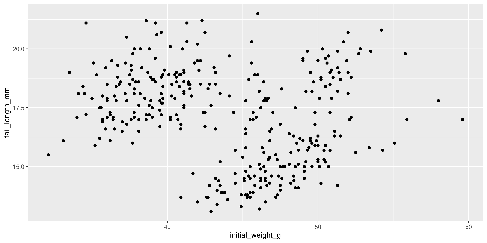
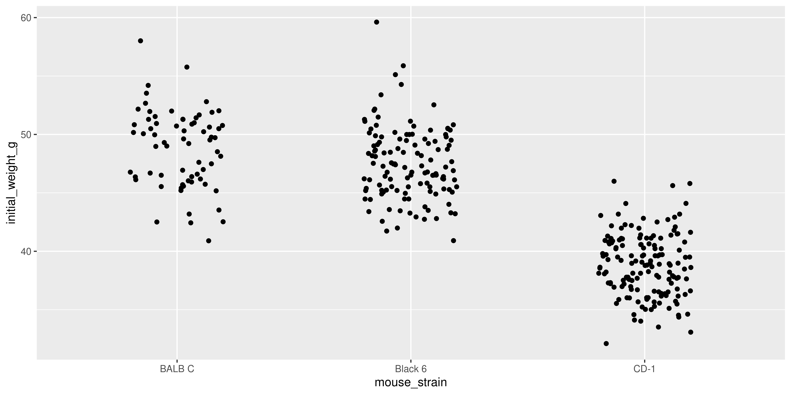
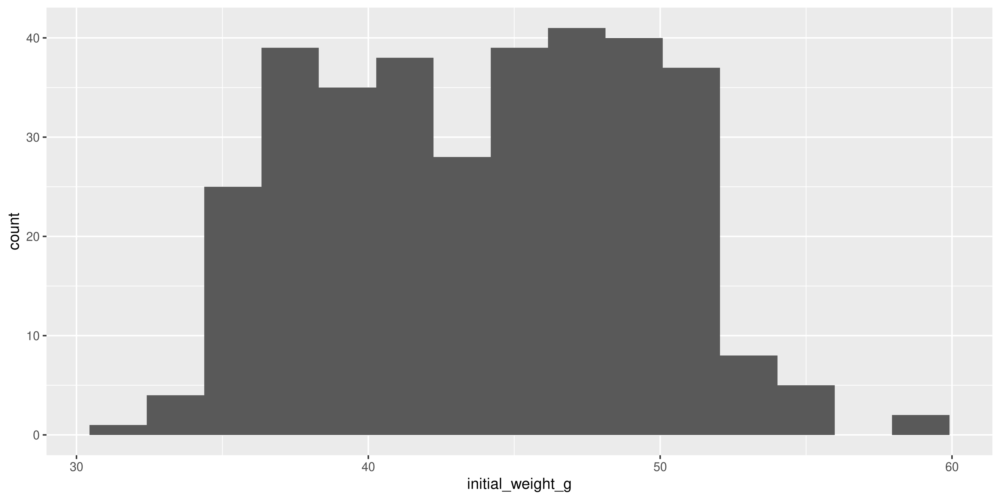
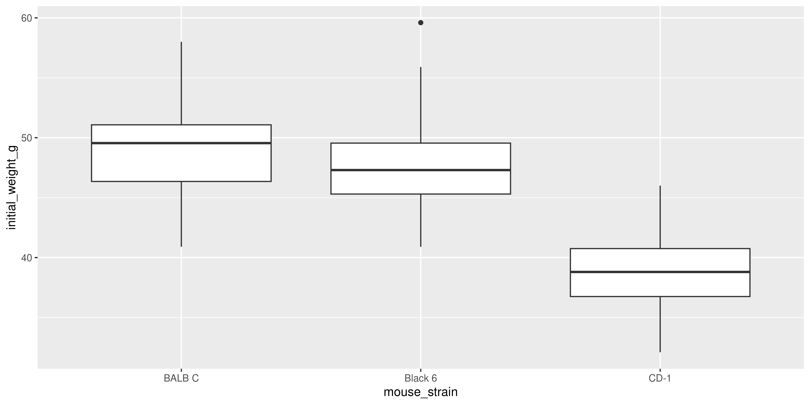
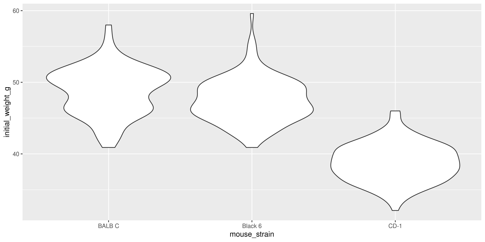
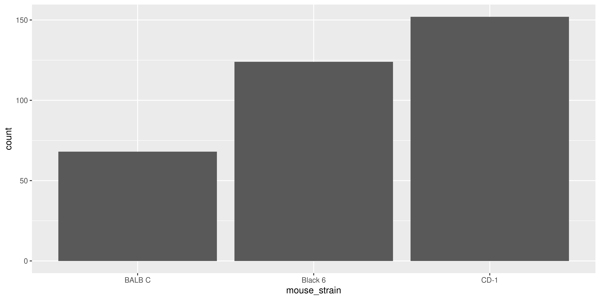

---
filters:
  - naquiz
format:
  html:
    toc: true
    toc-location: left
    toc-title: "In this session:"
---


# Session 3: Plotting with ggplot2 {#sec-session03}

In this session we will learn how to create and customise plots using the `ggplot2` package.

::: {.callout-tip title="Learning Objectives"}
At the end of this session, learners should be able to:

1.  Create a ggplot and save it for use outside of R
2.  Describe some of the common ways we can change the appearance of a plot, such as themes, legends and colours.
3.  List some of the common geoms available in ggplot2 and what types of data they might be useful for
4.  Use the `facet_wrap` function to create a series of similar plots
5.  Understand how to use the `patchwork` package to compose multiple plots together into a single figure
:::

To get started, let's load the `tidyverse` package, which includes `ggplot2`:


::: {.cell}

```{.r .cell-code}
library(tidyverse)
```

::: {.cell-output .cell-output-stderr}

```
── Attaching core tidyverse packages ──────────────────────── tidyverse 2.0.0 ──
✔ dplyr     1.1.4     ✔ readr     2.1.5
✔ forcats   1.0.0     ✔ stringr   1.5.1
✔ ggplot2   3.5.1     ✔ tibble    3.2.1
✔ lubridate 1.9.3     ✔ tidyr     1.3.1
✔ purrr     1.0.2     
── Conflicts ────────────────────────────────────────── tidyverse_conflicts() ──
✖ dplyr::filter() masks stats::filter()
✖ dplyr::lag()    masks stats::lag()
ℹ Use the conflicted package (<http://conflicted.r-lib.org/>) to force all conflicts to become errors
```


:::
:::


And read in the `mousezempic_dosage_data` that we have been using in previous sessions:


::: {.cell}

```{.r .cell-code}
mousezempic_dosage_data <- read_csv("data/mousezempic_dosage_data.csv")
```

::: {.cell-output .cell-output-stderr}

```
Rows: 344 Columns: 9
── Column specification ────────────────────────────────────────────────────────
Delimiter: ","
chr (4): mouse_strain, cage_number, replicate, sex
dbl (5): weight_lost_g, drug_dose_g, tail_length_mm, initial_weight_g, id_num

ℹ Use `spec()` to retrieve the full column specification for this data.
ℹ Specify the column types or set `show_col_types = FALSE` to quiet this message.
```


:::
:::


## Building our first plot, layer by layer

Although R has a built-in plotting system, `ggplot2` is a more powerful and flexible package for creating plots. The `gg` in `ggplot2` stands for "Grammar of Graphics", which is a way thinking about how each component of a plot (e.g. axes or colours) is part of the 'language' of data visualisation that allows you to compose complex plots piece by piece, just like you combine words to form sentences.

### Initialisation

When making a ggplot, the first thing you need to do is initialise it with the `ggplot()` function. This function takes two arguments:

-   the **data** that you want to visualise (a dataframe/tibble), and
-   **mapping**, which describes the scales that will be used to display the data (e.g. which variable should be the x axis, which should be represented by colour, etc.)

The mapping is specified using the `aes()` function, which stands for 'aesthetics'. It takes named arguments, where the names are the aesthetics you want to use to show your data (e.g. `x`, `y`, `colour`, `shape`, etc.) and the values are the names of the columns in your data that you want to use for those aesthetics.

For example, to make a plot to explore the relationship between the initial weight of the mice and their tail length, we would write:


::: {.cell}

```{.r .cell-code}
ggplot(data = mousezempic_dosage_data, aes(x = initial_weight_g, y = tail_length_mm))
```

::: {.cell-output-display}
{width=2000}
:::
:::


In the plot panel (bottom right hand corner), you should now see a blank plot with the x and y axes labelled with the column names we specified in the `aes()` function. There's no data on it yet, because we haven't told ggplot how to physically represent the data on the x and y scales we have specified.

### Adding data

Data is represented in ggplot using **geoms** (short for 'geometric objects'). A geom is a visual representation of the data in the plot, such as points, lines or bars. They are named `geom_*` where `*` is the type of geom you want to use. We will cover some of the most common geoms later in this session.

Geoms are added to plots layers (which are drawn on top of one another, like layers of a cake) using the `+` operator.

For example, let's add points to the plot that we initialised above using `geom_point()`:


::: {.cell}

```{.r .cell-code}
ggplot(data = mousezempic_dosage_data, aes(x = initial_weight_g, y = tail_length_mm)) +
  geom_point()
```

::: {.cell-output .cell-output-stderr}

```
Warning: Removed 2 rows containing missing values or values outside the scale range
(`geom_point()`).
```


:::

::: {.cell-output-display}
{width=2000}
:::
:::


This gives us a basic scatterplot of the data, with each point representing the tail length and initial weight of a mouse in our dataset.

Notice how we didn't have to specify the data or mapping again when we added the `geom_point()` layer, because the data and mapping are inherited from the initial `ggplot()` function call. This is a common pattern in ggplot2: you only need to specify the data and mapping once, and it is used by all subsequent layers.

::: {.callout-note title="The plus `+` vs the pipe `%>%`"}
You might have noticed that `+` in ggplot works similarly to the pipe operator `%>%` in the `dplyr` package in that you place it at the end of a line of code, but **`+` is only ever used in the context of plotting.**

Don't mix them up! A handy way to remember is that `+` looks a bit like the axes of a plot, so it's what you should use when plotting.
:::

### Overlaying additional data

Of course, this is a very simple plot. To show more information, we can add additional layers using the `+` operator, or use additional aesthetics.

For example, let's add a a layer containing a linear trendline using `geom_smooth(method = "lm")`:


::: {.cell}

```{.r .cell-code}
ggplot(data = mousezempic_dosage_data, aes(x = initial_weight_g, y = tail_length_mm)) +
  geom_point() +
  geom_smooth(method = "lm")
```

::: {.cell-output .cell-output-stderr}

```
`geom_smooth()` using formula = 'y ~ x'
```


:::

::: {.cell-output .cell-output-stderr}

```
Warning: Removed 2 rows containing non-finite outside the scale range
(`stat_smooth()`).
```


:::

::: {.cell-output .cell-output-stderr}

```
Warning: Removed 2 rows containing missing values or values outside the scale range
(`geom_point()`).
```


:::

::: {.cell-output-display}
{width=2000}
:::
:::


Here, we supplied the `method = "lm"` argument to `geom_smooth()` to tell it fit a linear model (lm for short) to the data and plot the line of best fit, surrounded by a 95% confidence interval. Most geoms will have additional arguments like this that you can use to customise their appearance. Remember that we can check the documentation for geoms and other functions using `?geom_smooth`.

::: {.callout-note title="ggplot2 and missing values"}
You might have noticed that, along with the plot, R is also printing a warning message that lets us know that some rows of our data contain missing values. ggplot2 will automatically remove these rows from the plot (and warn you that it's happening), but it's always a good idea to check your data for missing values before plotting it, as they can affect the results of your analysis. Recall from last session that we can do this by combining the `is.na()` function with `filter()`:


::: {.cell}

```{.r .cell-code}
# find the rows of our data that contain missing values in the columns we're plotting
mousezempic_dosage_data %>%
  filter(is.na(initial_weight_g), is.na(tail_length_mm))
```

::: {.cell-output .cell-output-stdout}

```
# A tibble: 2 × 9
  mouse_strain cage_number weight_lost_g replicate sex   drug_dose_g
  <chr>        <chr>               <dbl> <chr>     <chr>       <dbl>
1 CD-1         1A                     NA rep1      <NA>           NA
2 Black 6      3E                     NA rep3      <NA>           NA
# ℹ 3 more variables: tail_length_mm <dbl>, initial_weight_g <dbl>,
#   id_num <dbl>
```


:::
:::


From here on, we will hide these warnings in the ebook so that it's easier to read, but you'll still see them if you run the code in your own R session.
:::

We can also add additional aesthetics to the plot beyond just `x` and `y`. For example, let's use the `colour` aesthetic to represent the strain of each mouse. To do this, we add `colour = strain` to the `aes()` function that describes the mapping in the `ggplot()` call:


::: {.cell}

```{.r .cell-code}
ggplot(data = mousezempic_dosage_data,
  aes(x = initial_weight_g, y = tail_length_mm, colour = mouse_strain)) +
  geom_point() +
  geom_smooth(method = "lm")
```

::: {.cell-output .cell-output-stderr}

```
`geom_smooth()` using formula = 'y ~ x'
```


:::

::: {.cell-output .cell-output-stderr}

```
Warning: Removed 2 rows containing non-finite outside the scale range
(`stat_smooth()`).
```


:::

::: {.cell-output .cell-output-stderr}

```
Warning: Removed 2 rows containing missing values or values outside the scale range
(`geom_point()`).
```


:::

::: {.cell-output-display}
{width=2000}
:::
:::


Not only are the points now coloured by the strain of each mouse, but there are now three separate colour-coded trendlines, one for each strain. This is because the aesthetic mapping we supply to the `ggplot()` function when initialising the plot is inherited by **all** subsequent layers/geoms.

Notice as well how adding colour to the plot totally changes the way we perceive the data! Without colour and just plotting a single trendline, it appeared that there was an overall negative association between initial weight and tail length, but we can now see that there is actually a positive association within each strain. This is an example of [Simpson's Paradox](https://en.wikipedia.org/wiki/Simpson%27s_paradox), and shows why it's so important to visualise your data!

### Saving plots as images

Once you've created a plot you're happy with, you'll probably want to save it to use in a paper or presentation. You can do this programmatically using the `ggsave()` function.

To use `ggsave()`, you need to specify:

-   the filename you want to save the plot as (e.g. `"my_plot.png"`),
-   the plot object you want to save (by default, this is the last plot you created, but you can specify a plot that's been assigned to a variable),
-   the file type you want to save the plot as (e.g. `device = "png"`), and
-   the dimensions of the plot (e.g. `width = 6, height = 4`). Dimensions are in inches by default, but you can specify them in other units if you prefer by using the units argument (e.g. `units = "cm"`)

For example, to save the last plot we created as a .png file with dimensions of 5 by 7 inches, we would write:


::: {.cell}

```{.r .cell-code}
ggsave("coloured_scatterplot.png", device = "png", width = 5, height = 7)
```
:::


Or to save it as a .pdf file with dimensions of 20 by 30 cm:


::: {.cell}

```{.r .cell-code}
ggsave("coloured_scatterplot.pdf", device = "pdf", width = 20, height = 30, units = "cm")
```
:::


Generally, it's good practice to assign the plot you want to save to a variable, and provide that variable to the 'plot' argument of `ggsave()`, rather than relying on the last plot you created. This makes it more clear what plot you're saving, so that your code is more readable and reproducible.


::: {.cell}

```{.r .cell-code}
# first assign the plot to a variable
colourful_scatterplot <- ggplot(data = mousezempic_dosage_data,
  aes(x = initial_weight_g, y = tail_length_mm, colour = mouse_strain)) +
  geom_point() +
  geom_smooth(method = "lm")

# then save the plot: notice the 'plot' argument
ggsave("coloured_scatterplot.pdf", plot = colourful_scatterplot, device = "pdf", width = 20, height = 30, units = "cm")
```
:::


It's also possible to save plots using the export button in the plot panel: 

You can choose to save the plot either as an image: 

In this case, you can set the file type and dimensions, and see a preview of the plot before saving it. Tip: it's also possible to change the dimensions of the plot by dragging the bottom left of the preview window.

You can also save plots as a PDF: 

Although there is no preview for PDFs within RStudio itself, you can click the 'preview' button to open the PDF in your default PDF viewer.

In general, it's preferable to save plots programmatically using `ggsave()` because it's more reproducible (because if you ever change your plotting code or data, new plot files can be automatically generated), but the export button can be useful for quickly saving plots during exploratory data analysis (or use the ultimate lazy hack: just screenshot the plot panel!).

::: {.callout-important title="Practice exercises"}
Try these practice questions to test your understanding

::: question
1\. Which of the following statements about the mapping in a ggplot is **incorrect**?

::: choices
::: choice
Mapping is specified using the `aes()` function
:::

::: {.choice .correct-choice}
Mapping refers to the type of plot you want to create (e.g. scatterplot, line plot)
:::

::: choice
When you specify the mapping in the `ggplot()` function, it is inherited by all subsequent layers/geoms
:::

::: choice
Mapping allows you to specify which scales (e.g. x, y, colour) should be used to display the data
:::
:::
:::

::: question
2\. Which of the following lines of code is a valid way to create a scatterplot of the drug dosage (x) and weight loss (y) in the `mousezempic_dosage_data` dataset?

::: choices
::: choice
`ggplot(data = mousezempic_dosage_data, aes(x = drug_dosage, y = weight_loss)) %>% geom_point()`
:::

::: choice
`ggplot(data = mousezempic_dosage_data, x = drug_dosage, y = weight_loss) + geom_point()`
:::

::: choice
`ggplot2(data = mousezempic_dosage_data, aes(x = drug_dosage, y = weight_loss))`
:::

::: {.choice .correct-choice}
`ggplot(data = mousezempic_dosage_data, aes(x = drug_dosage, y = weight_loss)) + geom_point()`
:::
:::
:::

::: question

3. How could you programmatically save the plot created in question 2 as a .pdf file with dimensions of 10 by 15 cm?

::: choices
::: {.choice .correct-choice}
`ggsave("drug_dosage_vs_weight_loss.pdf", device = "pdf", width = 10, height = 15, units = "cm")`
:::

::: choice
`save("drug_dosage_vs_weight_loss.pdf", device = "pdf", width = 10, height = 15, units = "cm")`
:::

::: choice
`ggsave("drug_dosage_vs_weight_loss.pdf", device = "pdf", width = 10, height = 15)`
:::

::: choice
`ggsave("drug_dosage_vs_weight_loss.pdf", width = 10, height = 15)`
:::

<details>

<summary>Solutions</summary>

1.  Mapping in ggplot refers to the scales that will be used to display the data (e.g. x, y, colour), not the type of plot you want to create. It is specified using the `aes()` function, and when specified in the initial `ggplot()` function call, is inherited by all subsequent layers/geoms.
2.  The correct way to create a scatterplot of the drug dosage and weight loss in the `mousezempic_dosage_data` dataset is `ggplot(data = mousezempic_dosage_data, aes(x = drug_dosage, y = weight_loss)) + geom_point()`. This specifies the data and mapping in the `ggplot()` function call, and adds a layer of points to the plot using `geom_point()`. The `%>%` operator is not used in ggplot2, and the `x` and `y` mapping should be specified within the `aes()` function. Also, remember that although ggplot2 is the name of the package, the function you use to initialise a plot is `ggplot()`.
3.  To programmatically save the plot created in question 2 as a .pdf file with dimensions of 10 by 15 cm, you would use the `ggsave()` function with the arguments `ggsave("drug_dosage_vs_weight_loss.pdf", device = "pdf", width = 10, height = 15, units = "cm")`. This specifies the filename, file type, dimensions, and units of the plot you want to save. Remember that by default, dimensions are in inches (boooo), so you need to specify the units as "cm" to save the plot with dimensions in centimetres.

</details>

:::

## Some commonly used visualisations

ggplot2 has (as of writing) almost 50 different geoms that you can use to represent your data. You can see the full list in the [ggplot2 documentation](https://ggplot2.tidyverse.org/reference/#geoms), but some of the most commonly used geoms include:

-   `geom_point()` for visualising individual data points
-   `geom_density()` and `geom_histogram()` for visualising the distribution of a continuous variable
-   `geom_violin()` and `geom_boxplot()` for visualising the distribution of a continuous variable **across different categories**
-   `geom_bar()` and `geom_col()` for making bar plots
-   `geom_h/vline()` for adding horizontal and vertical lines to a plot

In this section, we will briefly cover these geoms and how you might use them to visualise your data. It's not designed to be an exhaustive list, but hopefully it will help you get started with some of the most common types of plots you might want to create.

::: {.callout-note title="How do I make a ... plot in ggplot2?"}
Often, you might come across a specific type of plot you want to make that is a bit more complex than the basic geoms we've covered here. If you know the name of the plot you're wanting to make, you can often find a tutorial/guide online by googling, or you could ask an AI assistant like ChatGPT. Particularly for specific types of data (e.g. clinical data, phylogenetic data), there are often field-specific packages that provide geoms or functions to make particular types of plots, like the [ggtree package](https://yulab-smu.top/treedata-book/index.html) for phylogenetic trees or the [survminer package](https://rpkgs.datanovia.com/survminer/) for survival plots.

If the plot doesn't have a specifc name, you can try to break it down by thinking about the geoms you might need to use to represent the data, or try uploading a picture of a similar plot to ChatGPT.

Whatever method you use, remember to add 'ggplot2' to your search query to get the most relevant results, as there are many different plotting packages in R!
:::

### Visualising individual data points: geom_point

Above, we saw how to use `geom_point()` to create a scatterplot, but `geom_point()` can be used in other ways too. For example, you can use it to create a dot plot, where the x axis is categorical and the y axis is continuous:


::: {.cell}

```{.r .cell-code}
# make a dot plot of initial weight by mouse strain
ggplot(data = mousezempic_dosage_data, aes(x = mouse_strain, y = initial_weight_g)) +
  geom_point()
```

::: {.cell-output-display}
{width=2000}
:::
:::


Notice how the points are stacked on top of one another for each strain. This is because the x axis is categorical, and ggplot2 doesn't know how to spread the points out. This can make it difficult to see the individual points, so when making a plot like this it's often useful to add the  `position = position_jitter()` argument to `geom_point()`:


::: {.cell}

```{.r .cell-code}
# make a jittered dot plot of initial weight by mouse strain
ggplot(data = mousezempic_dosage_data, aes(x = mouse_strain, y = initial_weight_g)) +
  geom_point(position = position_jitter())
```

::: {.cell-output-display}
{width=2000}
:::
:::

The `position_jitter()` function adds a small amount of random noise to the x axis position of each point, which helps to spread them out and make it easier to see the individual points. Like most functions in ggplot2, `position_jitter()` will try to guess an appropriate amount of jitter to add, but you can specify the amount as well:


::: {.cell}

```{.r .cell-code}
# use less jitter so there is more distinction between the different mouse strains
ggplot(data = mousezempic_dosage_data, aes(x = mouse_strain, y = initial_weight_g)) +
  geom_point(position = position_jitter(width = 0.2))
```

::: {.cell-output-display}
{width=2000}
:::
:::

The exact amount of jitter you need will depend heavily on your data, so it's often a good idea to experiment with different amounts to see what works best.

::: {.callout-note title="Beeswarm plots"}
Another way to spread out points in a dot plot is to use a beeswarm plot, in which points are spread out slightly along the x axis so that they don't overlap. The `ggbeeswarm` package provides a `geom_beeswarm()` function that you can use to create beeswarm plots in ggplot2 (rather than using `geom_point(position = position_jitter())` like we did here). For more information, see the [ggbeeswarm documentation](https://github.com/eclarke/ggbeeswarm/blob/main/README.md).
:::

Beyond just scatterplots and dot plots, `geom_point()` is also really useful to overlay additional data on top of other geoms. For example, you can use it to add individual data points to a boxplot or violin plot, as we will see shortly!

### Visualising the distribution of a continuous variable: geom_histogram / geom_density
As the number of data points increases, it can be difficult to see individual points. In this case, it can be useful to visualise the distribution of a continuous variable using a histogram or density plot.

Histograms are created using the `geom_histogram()` function. Seeing as only a single variable is being plotted, you only need to specify the `x` aesthetic in the `aes()` function.

For example, let's create a histogram of the initial weight of the mice:

::: {.cell}

```{.r .cell-code}
ggplot(data = mousezempic_dosage_data, aes(x = initial_weight_g)) +
  geom_histogram()
```

::: {.cell-output-display}
{width=2000}
:::
:::


One of the most important arguments to `geom_histogram()` is the `bins` argument, which specifies the number of bins (bars) to use for the histogram. By default, it is 30, but you might want a smaller or larger value depending on the distribution of your data. For example, let's create a histogram with 15 bins:


::: {.cell}

```{.r .cell-code}
ggplot(data = mousezempic_dosage_data, aes(x = initial_weight_g)) +
  geom_histogram(bins = 15)
```

::: {.cell-output-display}
{width=2000}
:::
:::


Similarly to histograms, density plots are also used to visualise the distribution of a continuous variable, but they are smoothed out. To create a density plot in ggplot2, you can use the `geom_density()` function:


::: {.cell}

```{.r .cell-code}
ggplot(data = mousezempic_dosage_data, aes(x = initial_weight_g)) +
  geom_density()
```

::: {.cell-output-display}
{width=2000}
:::
:::


Notice how the density plot is smoothed out compared to the histogram, and it is also scaled so that the area under the curve is equal to 1. This means that the y axis of a density plot represents the probability density of the data, rather than the count of data points in each bin.

### Visualising the distribution of a continuous variable across categories: geom_boxplot / geom_violin
Often in biological data, you will want to visualise the distribution of a continuous variable across different categories. For example, we might want to see how the initial weight of the mice varies by strain. Two plot types that are useful for this are boxplots and violin plots.

Boxplots allow you to easily see the median, quartiles, and any outliers in the data. To create a boxplot win ggplot2, you can use the `geom_boxplot()` function:


::: {.cell}

```{.r .cell-code}
ggplot(data = mousezempic_dosage_data, aes(x = mouse_strain, y = initial_weight_g)) +
  geom_boxplot()
```

::: {.cell-output-display}
{width=2000}
:::
:::


It can sometimes be nice to add points to a boxplot to show the individual data points as well as the summary statistics. You can do this by adding a `geom_point()` layer to the plot:


::: {.cell}

```{.r .cell-code}
ggplot(data = mousezempic_dosage_data, aes(x = mouse_strain, y = initial_weight_g)) +
  geom_boxplot() +
  geom_point(position = position_jitter(width = 0.2))
```

::: {.cell-output-display}
{width=2000}
:::
:::

This plot shows the distribution of initial weight for each strain (with the boxplot), as well as the individual data points. Notice how the points are jittered to avoid overlapping, as we did earlier with the dot plot.

However, when you have a lot of data points (as we do here), a boxplot with overlaid points can be a bit messy and hard to read. In this case, it might be better to use a violin plot instead, which shows the distribution of the data as a density plot:


::: {.cell}

```{.r .cell-code}
ggplot(data = mousezempic_dosage_data, aes(x = mouse_strain, y = initial_weight_g)) +
  geom_violin()
```

::: {.cell-output-display}
{width=2000}
:::
:::


You can even combine `geom_violin()` with `geom_boxplot()` to show both the distribution of the data and the summary statistics:


::: {.cell}

```{.r .cell-code}
ggplot(data = mousezempic_dosage_data, aes(x = mouse_strain, y = initial_weight_g)) +
  geom_violin() +
  geom_boxplot(width = 0.1)
```

::: {.cell-output-display}
{width=2000}
:::
:::

Notice how we specified the `width` argument in `geom_boxplot()` to make the boxplot narrower, so that it doesn't obscure the violin plot.

### geom_bar / geom_col
The last pair of basic geoms we'll cover are `geom_bar()` and `geom_col()`, which are used to create bar plots. These are handy for visualising categorical data, such as the number of mice in each strain or the average weight loss for each dosage.

`geom_bar()` is used to create bar plots from counts of categorical data, while `geom_col()` is used to create bar plots from pre-computed values. This means that if you have already calculated the counts or averages for each category, you should use `geom_col()` instead of `geom_bar()`.

For example, if we wanted to create a bar plot of the number of mice in each strain with `geom_col()`, we would first need to calculate the counts for each strain:


::: {.cell}

```{.r .cell-code}
# first count the number of mice per strain
mouse_counts <- mousezempic_dosage_data %>%
  group_by(mouse_strain) %>%
  summarise(count = n())

# then create the bar plot
ggplot(data = mouse_counts,
  aes(x = mouse_strain, y = count)) +
  geom_col()
```

::: {.cell-output-display}
{width=2000}
:::
:::


Whereas if we used `geom_bar()`, we would not need to calculate the counts first:


::: {.cell}

```{.r .cell-code}
ggplot(data = mousezempic_dosage_data,
  aes(x = mouse_strain)) +
  geom_bar()
```

::: {.cell-output-display}
{width=2000}
:::
:::


Notice how we only specified the `x` aesthetic in the `aes()` function, and `geom_bar()` automatically calculated the counts for each strain.

The advantage of using `geom_bar()` is that it is simpler and easier to read for plotting counts, but it can't be used for plotting pre-computed values. For example, if you wanted to plot the average weight loss for each strain, you would need to calculate the averages first with the dplyr functions we learned in @sec-session02 and use `geom_col()`:


::: {.cell}

```{.r .cell-code}
# first calculate the average weight loss for each strain
mouse_avg_weight_loss <- mousezempic_dosage_data %>%
  group_by(mouse_strain) %>%
  summarise(avg_weight_loss = mean(weight_lost_g))

# then create the bar plot
ggplot(data = mouse_avg_weight_loss,
  aes(x = mouse_strain, y = avg_weight_loss)) +
  geom_col()
```

::: {.cell-output .cell-output-stderr}

```
Warning: Removed 2 rows containing missing values or values outside the scale range
(`geom_col()`).
```


:::

::: {.cell-output-display}
{width=2000}
:::
:::


<!-- ### geom_line
Idk how useful geom_line is ? i feel like i use density more often
As the name suggests, `geom_line()` is used to create line plots. These are useful for showing trends over time or across a continuous variable. Since we don't have a time variable in our dataset, let's use the `drug_dosage` variable to show how weight loss changes with increasing dosage:


::: {.cell}

```{.r .cell-code}
ggplot(data = mousezempic_dosage_data, aes(x = drug_dose_g, y = weight_lost_g)) +
  geom_line()
```

::: {.cell-output-display}
{width=2000}
:::
:::

(In reality the relationship between these variables is probably better represented as points on a scatterplot rather than as a line, but this is just an example of how you can use `geom_line()`).

It's also possible to combine `geom_line()` with `geom_point()` to show the individual data points as well as the connection between them:


::: {.cell}

```{.r .cell-code}
ggplot(data = mousezempic_dosage_data, aes(x = drug_dose_g, y = weight_lost_g)) +
  geom_line() +
  geom_point()
```

::: {.cell-output-display}
{width=2000}
:::
:::

 -->
### geom_hline / geom_vline
The `geom_hline()` and `geom_vline()` functions are used to add horizontal and vertical lines to a plot, respectively. Although you'll probably never use them alone, they are great to add to your plots to highlight specific values or thresholds in your data. To use them, you need to specify the `yintercept` (for `geom_hline()`) or `xintercept` (for `geom_vline()`) argument, which specifies where to draw the line.

For example, let's add a horizontal line to our scatterplot of drug dosage and weight loss at the 4g mark, which might represent a clinically significant amount of weight loss:


::: {.cell}

```{.r .cell-code}
ggplot(data = mousezempic_dosage_data, aes(x = drug_dose_g, y = weight_lost_g)) +
  geom_point() +
  geom_hline(yintercept = 4)
```

::: {.cell-output-display}
{width=2000}
:::
:::


We could also add a vertical line at the 0.0025g mark to show the theorectical maximum dosage of the drug:


::: {.cell}

```{.r .cell-code}
ggplot(data = mousezempic_dosage_data, aes(x = drug_dose_g, y = weight_lost_g)) +
  geom_point() +
  geom_hline(yintercept = 4) +
  geom_vline(xintercept = 0.0025)
```

::: {.cell-output-display}
{width=2000}
:::
:::

Notice how adding this line extends the x axis to include 0.0025, even though there are no data points at that value. This is because, by default, ggplot2 chooses axes limits for you that include all the data and any additional layers you add to the plot.

::: {.callout-important title="Practice exercises"}
Try these practice questions to test your understanding

::: question
1\. Which geom could you use to create a boxplot?

::: choices
::: {.choice .correct-choice}
`geom_boxplot()`
:::

::: choice
`geom_box()`
:::

::: choice
`geom_col()`
:::

::: choice
`geom_violin()`
:::
:::
:::

::: question
2\. Which of the following lines of code is a valid way to create a boxplot of the with points overlaid

::: choices
::: choice
`ggplot(data = mousezempic_dosage_data, aes(x = drug_dosage, y = weight_loss)) %>% geom_point()`
:::

::: choice
`ggplot(data = mousezempic_dosage_data, x = drug_dosage, y = weight_loss) + geom_point()`
:::

::: choice
`ggplot2(data = mousezempic_dosage_data, aes(x = drug_dosage, y = weight_loss))`
:::

::: {.choice .correct-choice}
`ggplot(data = mousezempic_dosage_data, aes(x = drug_dosage, y = weight_loss)) + geom_point()`
:::
:::
:::

::: question

3. How could you programmatically save the plot created in question 2 as a .pdf file with dimensions of 10 by 15 cm?

::: choices
::: {.choice .correct-choice}
`ggsave("drug_dosage_vs_weight_loss.pdf", device = "pdf", width = 10, height = 15, units = "cm")`
:::

::: choice
`save("drug_dosage_vs_weight_loss.pdf", device = "pdf", width = 10, height = 15, units = "cm")`
:::

::: choice
`ggsave("drug_dosage_vs_weight_loss.pdf", device = "pdf", width = 10, height = 15)`
:::

::: choice
`ggsave("drug_dosage_vs_weight_loss.pdf", width = 10, height = 15)`
:::

<details>

<summary>Solutions</summary>

1.  Mapping in ggplot refers to the scales that will be used to display the data (e.g. x, y, colour), not the type of plot you want to create. It is specified using the `aes()` function, and when specified in the initial `ggplot()` function call, is inherited by all subsequent layers/geoms.
2.  The correct way to create a scatterplot of the drug dosage and weight loss in the `mousezempic_dosage_data` dataset is `ggplot(data = mousezempic_dosage_data, aes(x = drug_dosage, y = weight_loss)) + geom_point()`. This specifies the data and mapping in the `ggplot()` function call, and adds a layer of points to the plot using `geom_point()`. The `%>%` operator is not used in ggplot2, and the `x` and `y` mapping should be specified within the `aes()` function. Also, remember that although ggplot2 is the name of the package, the function you use to initialise a plot is `ggplot()`.
3.  To programmatically save the plot created in question 2 as a .pdf file with dimensions of 10 by 15 cm, you would use the `ggsave()` function with the arguments `ggsave("drug_dosage_vs_weight_loss.pdf", device = "pdf", width = 10, height = 15, units = "cm")`. This specifies the filename, file type, dimensions, and units of the plot you want to save. Remember that by default, dimensions are in inches (boooo), so you need to specify the units as "cm" to save the plot with dimensions in centimetres.

</details>

:::

## Working with scales
Now that we've learned some of the common geoms we can use to physically our data, let's discuss the scales we can use to control how values are mapped to aesthetics (like colour or size).

### Transformations on the x and y axes

### Scales controlling visual aesthetics

log transformation, changing colour palette

## Making a plot pretty
Now that we've covered the basics of creating plots in ggplot2, let's talk about how to make them look good (because so far, the ones we've made have been a little plain looking!)

There are countless ways to customise the appearance of a plot in ggplot2, and we'll cover some of the most common ones here.

### Labels and text

adding title, axis labels

changing size etc to be readable

how to remove scientific notation on axes

### Themes

introduce concept of themes

how to modify parts of themes

### Changing colours/sizes/shapes

exactly what it sounds like

mention about

### Legends

changing position, removing it

## Making many similar plots with facets

how to facet with facet_wrap() and scales = "free" or not

## Laying out multiple plots into a single figure

combining plots with patchwork

## Summary

::: {.callout-note title="Useful packages that extend ggplot2"}
There are many packages that extend the functionality of ggplot2, such as:

there are also a wealth of extensions to ggplot2 that provide additional geoms or functionality for specific types of data or plots, such as...
:::

### Practice questions
