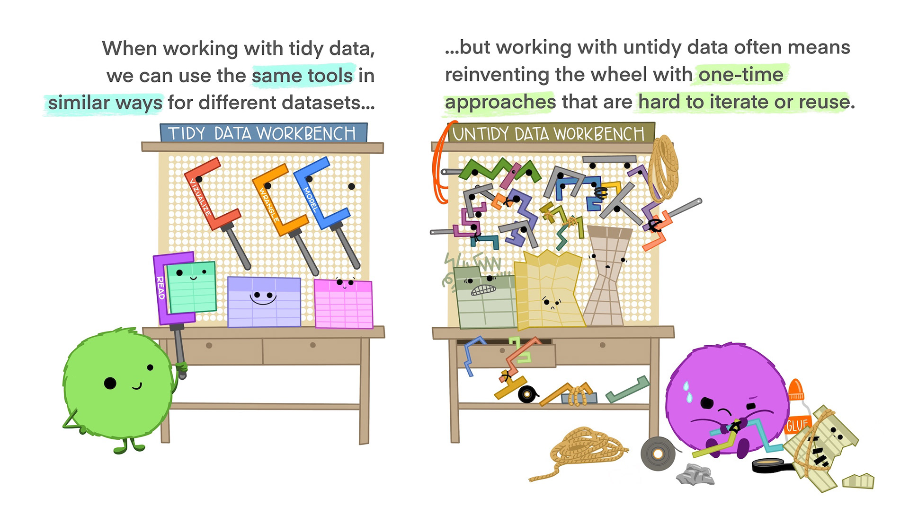
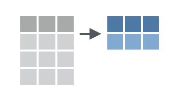
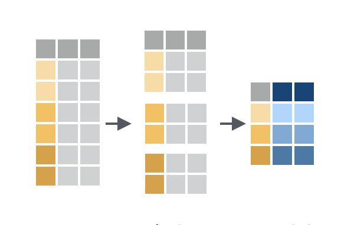
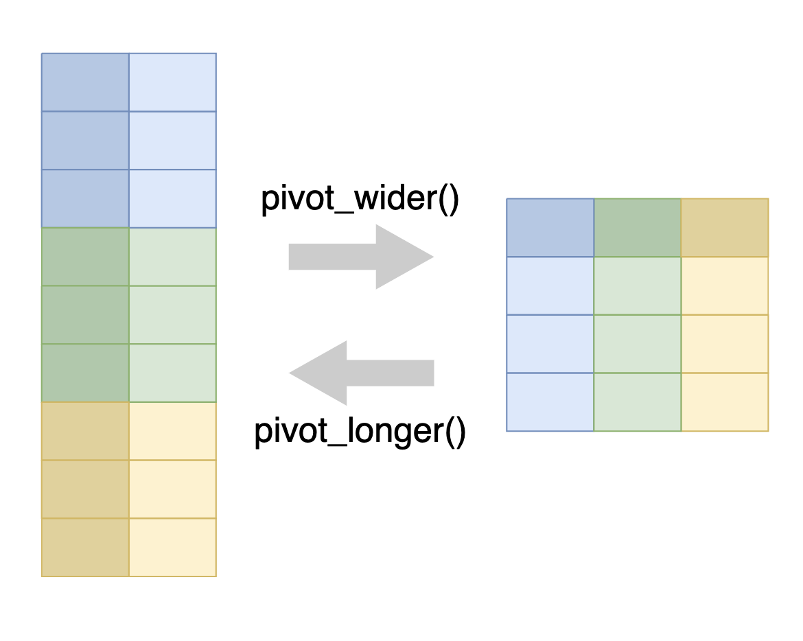
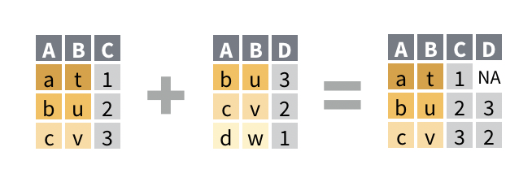

---
filters:
  - naquiz
format:
  html:
    toc: true
    toc-location: left
    toc-title: "In this session:"
---

# Workshop 3: Data-wrangling {#sec-workshop03}

In this session we will cover more advanced data manipulations that can be used
to make our data 'tidy' and perform sophisticated analyses.

::: {.callout-tip title="Learning Objectives"}
At the end of this session, learners should be able to:

1.  Explain the concept and purpose of 'tidy' data

2.  Apply grouping and summarising for more complex analysis of data

3.  Understand how pivot, separate and join functions can be used to reshape and 
combine entire data frames

4.  Recall how to save data frames to a file
:::

## Introduction

For our analysis, we will use the `dosage` and `genes` data frames, which 
contain information about the mice treated with mousezempic and their gene 
expression levels, respectively.

The first thing we need to do is load the tidyverse:

```{r}
#| message: false
# tidyverse package contains everything we'll need
library(tidyverse)
```

And read in the two datasets:

```{r}
# read in dosage data
dosage <- read_csv("data/mousezempic_dosage_data.csv")

# read in expression data
genes <- read_tsv("data/mousezempic_expression_data.tsv")
```

::: {.callout-note title="How do we read in data again?"}
Note that we used `read_csv()` for the mouse dosage data and `read_tsv()` for 
the expression data. We chose these functions to match the file extensions of 
the two datasets, as described when we first learned about reading in data in 
last week (see @sec-readingin).
:::

Before we go further, let's take a moment to explore the `genes` dataset, as 
it's new in this session.

```{r}
genes
```

This data frame contains expression levels of two genes (TH and PRLH) suspected 
to be upregulated in mice taking mousezempic, as well as one housekeeping gene 
(HPRT1), all measured in triplicate. Each mouse has a unique ID number 
(`id_num` column), which matches with those in the `dosage` dataset, but there 
are also additional control mice, who have not received mousezempic (as 
described in the `group` column).

## Tidy data {#sec-tidy-data}

Before we can proceed with analysis of this data (or any data really), we need 
to ensure that our data is **"tidy"**.

This is because the tidyverse packages we are using revolve around the concept 
of "[tidy data](https://r4ds.hadley.nz/data-tidy.html)", which is a specific 
way of organising data into a table so that it is easy to work with. Tidy data 
is roughly defined as tabular data that contains:

1.  Individual variables in columns
2.  Individual observations in rows
3.  One data value in each cell

In other words, each column in our datasets should represent a particular 
measurement (like expression of the TH gene or the sex of the mice), and each 
row should contain all of the measurements available for a particular mouse.

::: {.callout-note title="*Why* is tidy data easy to work with?"}
[This cartoon from Allison Horst](https://allisonhorst.com/other-r-fun) sums 
it up well: {width="80%"}
:::

Although tidy data is the easiest to work with, it's often necessary to alter 
the format of your data for plotting or table displays. It's a good idea to keep
your core data in a tidy format and treating plot or table outputs as 
representations of that tidy data.

::: {.callout-note title="Data wrangling?"}
Most data you encounter will not be tidy, so the first part of data analysis is 
usually called "data wrangling" or "data cleaning" and involves tidying up your 
data (by "wrangling" it into shape) so it is easier to use for downstream 
analysis. Later in this session, we will practice data wrangling by tidying up 
the `genes` data frame.
:::

## Summarising and grouping data
Luckily, the `dosage` data is already quite tidy (you're welcome!). Let's take
a moment to use it to learn about summarising and grouping data, which are two
powerful `dplyr` functions we can use on our tidy data to ask more complex
questions of it.

### Summarising data {#sec-summarise}



The `summarise()` (or `summarize()`, if you prefer US spelling) function is used
to calculate summary statistics on your data. It takes similar arguments to 
`mutate()`, but instead of adding a new column to the data frame, it returns a 
new data frame with a single row and one column for each summary statistic you 
calculate.

For example, to calculate the mean weight lost by the mice in the `dosage` data 
frame:

```{r}
dosage %>%
  summarise(mean_weight_lost = mean(weight_lost_g, na.rm = TRUE))
```

We can also calculate multiple summary statistics at once. For example, to 
calculate the mean, median, and standard deviation of the weight lost by the mice:

```{r}
dosage %>%
  summarise(
    mean_weight_lost = mean(weight_lost_g, na.rm = TRUE),
    median_weight_lost = median(weight_lost_g, na.rm = TRUE),
    sd_weight_lost = sd(weight_lost_g, na.rm = TRUE)
  )
```

The power of summarising data is really seen when combined with grouping, which
we will cover in the next section.

::: {.callout-important title="Practice exercises"}
Try these practice questions to test your understanding

::: question
1\. Explain in words what the following code does:

```{r}
#| eval: false
dosage %>%
  summarise(average_tail = mean(tail_length_mm, na.rm = TRUE),
            min_tail = min(tail_length_mm, na.rm = TRUE),
            max_tail = max(tail_length_mm, na.rm = TRUE))
```

::: choices
::: choice
Calculates the average, minimum, and maximum tail length of the mice in the 
`dosage` data frame.
:::

::: {.choice .correct-choice}
Produces a data frame containing one column for each of the average, minimum, 
and maximum tail length of the mice in the `dosage` data frame.
:::

::: choice
Finds the average tail length of the mice in the `dosage` data frame.
:::

::: choice
Produces a vector containing the average, minimum, and maximum tail length of 
the mice in the `dosage` data frame.
:::
:::
:::

::: question
2\. What is NOT a valid way to calculate the mean weight lost by the mice in 
the `dosage` data frame?

::: choices
::: choice
`dosage %>% summarise(mean_weight_lost = mean(weight_lost_g, na.rm = TRUE))`
:::

::: choice
`dosage %>% pull(weight_lost_g) %>% mean(na.rm = TRUE)`
:::

::: choice
`dosage %>% summarize(mean_weight_lost = mean(weight_lost_g, na.rm = TRUE))`
:::

::: {.choice .correct-choice}
`dosage %>% mean(weight_lost_g, na.rm = TRUE)`
:::
:::
:::

<details>

<summary>Solutions</summary>

1\. The code **produces a data frame** containing one column for each of the 
average, minimum, and maximum tail length of the mice in the `dosage` data frame.

2\. The line of code that is NOT a valid way to calculate the mean weight lost 
by the mice in the `dosage` data frame is 
`dosage %>% mean(weight_lost_g, na.rm = TRUE)`. This line of code is incorrect 
because the `mean()` function is being used directly on the data frame, rather 
than within a `summarise()` function. The other options are valid ways to 
calculate the mean weight lost by the mice in the `dosage` data frame (although 
note that the second option uses `pull()` to extract the `weight_lost_g` column 
as a vector before calculating the mean, so the mean value is stored in a vector 
rather than in a data frame).

</details>
:::

## Grouping {#sec-grouping}



Grouping is a powerful concept in in `dplyr` that allows you to perform 
operations on subsets of your data. For example, you might want to calculate the
mean weight lost by mice in each cage, or find the mouse with the longest tail 
in each strain.

We can group data using the `.by` argument that exists in many dplyr functions, 
like `summarise()` and `mutate()`, and passing it the name(s) of column(s) to 
group by. For example, to calculate the mean weight lost by mice in each cage:

```{r}
dosage %>%
  summarise(
    mean_weight_lost = mean(weight_lost_g, na.rm = TRUE),
    # don't forget it's .by, not by!
    .by = cage_number)
```

Like when we first learned the summarise function above, we give our new column 
a name (`mean_weight_lost`), and then we assign its value to be the mean of the `weight_lost_g` column (with `NA`s removed). But this time, we also added the 
`.by` argument to specify the column we want to group by (`cage_number`, in this 
case). This will return a data frame with the mean weight lost by mice in each 
cage.

Grouping is a powerful tool for exploring your data and can help you identify 
patterns that might not be obvious when looking at the data as a whole. For 
example, notice how this grouped summary reveals that mice in cage 3E lost more 
weight than those in the other two cages.

It's also possible to group by multiple columns by passing a vector of column 
names to the `.by` argument. For example, to calculate the mean weight lost by 
mice in each cage and strain:

```{r}
dosage %>%
  summarise(mean_weight_lost = mean(weight_lost_g, na.rm = TRUE),
  # group by both cage_number and mouse_strain
    .by = c(cage_number, mouse_strain))
```

Of course, `mean()` is not the only function that we can use within 
`summarise()`. We can use any function that takes a vector of values and returns 
a single value, like `median()`, `sd()`, or `max()`. We can also use multiple 
functions at once, by giving each column a name and specifying the function we 
want to use:

```{r}
dosage %>%
  summarise(
    n = n(),
    mean_weight_lost = mean(weight_lost_g, na.rm = TRUE),
    median_weight_lost = median(weight_lost_g, na.rm = TRUE),
    sd_weight_lost = sd(weight_lost_g, na.rm = TRUE),
    max_weight_lost = max(weight_lost_g, na.rm = TRUE),
    min_weight_lost = min(weight_lost_g, na.rm = TRUE),
    .by = cage_number)
```

Here, we also used the `n()` function to calculate the number of mice in each 
cage. This is a special helper function that works within `summarise` to count
the number of rows in each group.

::: {.callout-note title="To `.by` or not to `.by`?"}
In the `dplyr` package, there are two ways to group data: using the `.by` 
argument within various functions (as we have covered so far), or using the 
`group_by()` function, then performing your operations and ungrouping with 
`ungroup()`.

For example, we've seen above how to calculate the mean weight lost by mice in 
each cage using the `.by` argument:

```{r}
dosage %>%
  summarise(mean_weight_lost = mean(weight_lost_g, na.rm = TRUE), .by = cage_number)
```

But we can also do the same using `group_by()` and `ungroup()`:

```{r}
dosage %>%
  group_by(cage_number) %>%
  summarise(mean_weight_lost = mean(weight_lost_g, na.rm = TRUE)) %>%
  ungroup()
```

The two methods are equivalent, but using the `.by` argument within functions
can be more concise and easier to read. Still, it's good to be aware of
`group_by()` and `ungroup()` as they are widely used, particularly in older
code.
:::

Although grouping is most often used with `summarise()`, it can be used with
other `dplyr` functions too. For example mutate() function can also be used with
grouping to add new columns to the data frame based on group-specific
calculations. Let's say we wanted to calculate the Z-score (also known as the
[standard score](https://en.wikipedia.org/wiki/Standard_score)) to standardise
the weight lost by each mouse within each strain.

As a reminder, the formula for calculating the Z-score is 
$\frac{x - \mu}{\sigma}$, where $x$ is the value (in our case the
`weight_lost_g` column), $\mu$ is the mean, and $\sigma$ is the standard 
deviation.

We can calculate this for each mouse in each strain using the following code:

```{r}
dosage %>%
  # remove NAs before calculating the mean and SD
  filter(!is.na(weight_lost_g)) %>%
  mutate(weight_lost_z = (weight_lost_g - mean(weight_lost_g)) / sd(weight_lost_g), .by = mouse_strain) %>%
  # select the relevant columns
  select(mouse_strain, weight_lost_g, weight_lost_z)
```

Unlike when we used `.by` with `summarise()`, we still get the same number of
rows as the original data frame, but now we have a new column `weight_lost_z`
that contains the Z-score for each mouse within each strain. This could be
useful for identifying outliers or comparing the weight lost by each mouse to
the average for its strain.

::: {.callout-important title="Practice exercises"}
Try these practice questions to test your understanding

::: question
1\. Which line of code would you use to calculate the median tail length of mice 
belonging to each strain in the `dosage` data frame?

::: choices
::: choice
`dosage %>% summarise(median_tail_length = median(tail_length_mm), .by = mouse_strain)`
:::

::: {.choice .correct-choice}
`dosage %>% summarise(median_tail_length = median(tail_length_mm, na.rm = TRUE), .by = mouse_strain)`
:::

::: choice
`dosage %>% summarise(median_tail_length = median(tail_length_mm, na.rm = TRUE), by = mouse_strain)`
:::

::: choice
`dosage %>% mutate(median_tail_length = median(tail_length_mm, na.rm = TRUE), .by = mouse_strain)`
:::
:::
:::

::: question
2\. Explain in words what the following code does:

```{r}
#| eval: false
dosage %>%
  summarise(max_tail_len = max(tail_length_mm, na.rm = TRUE), .by = c(mouse_strain, replicate))
```

::: choices
::: choice
Calculates the maximum tail length of all mice for each strain in the `dosage` 
data frame
:::

::: choice
Calculates the maximum tail length of all mice for each replicate in the 
`dosage` data frame
:::

::: choice
Calculates the maximum tail length of all mice in the `dosage` data frame
:::

::: {.choice .correct-choice}
Calculates the maximum tail length of mice in each unique combination of strain 
and replicate in the `dosage` data frame.
:::
:::
:::

::: question
3\. I want to count how many male and how many female mice there are for each 
strain in the `dosage` data frame. Which line of code would I use?

::: choices
::: choice
`dosage %>% summarise(count = n(), .by = sex)`
:::

::: choice
`dosage %>% summarise(count = n(), .by = mouse_strain)`
:::

::: {.choice .correct-choice}
`dosage %>% summarise(count = n(), .by = c(mouse_strain, sex))`
:::

::: choice
`dosage %>% summarise(count = n(), .by = mouse_strain, sex)`
:::
:::
:::

::: question
4\. I want to find the proportion of weight lost **by each mouse** in each cage 
in the `dosage` data frame. Which line of code would I use?

::: choices
::: choice
`dosage %>% summarise(weight_lost_proportion = weight_lost_g / sum(weight_lost_g, na.rm = TRUE), .by = cage_number)`
:::

::: {.choice .correct-choice}
`dosage %>% mutate(weight_lost_proportion = weight_lost_g / sum(weight_lost_g, na.rm = TRUE), .by = cage_number)`
:::

::: choice
`dosage %>% mutate(weight_lost_proportion = weight_lost_g / sum(weight_lost_g, na.rm = TRUE, .by = cage_number))`
:::

::: choice
`dosage %>% mutate(weight_lost_proportion = weight_lost_g / sum(weight_lost_g, na.rm = TRUE))`
:::
:::
:::

<details>

<summary>Solutions</summary>

<p>

1.  The correct line of code to calculate the median tail length of mice 
belonging to each strain in the `dosage` data frame is `dosage %>% summarise(median_tail_length = median(tail_length_mm, na.rm = TRUE), .by = mouse_strain)`. Remember to use `na.rm = TRUE` to remove any missing values before calculating 
the median, and to use `.by` to specify the column to group by (not `by`). 
Seeing as we want to calculate the median (collapse down to a single value per 
group), we need to use `summarise()` rather than `mutate()`.
2.  The code `dosage %>% summarise(max_tail_len = max(tail_length_mm, na.rm = TRUE), .by = c(mouse_strain, replicate))` calculates the maximum tail length of mice in each 
**unique combination** of strain and replicate in the `dosage` data frame.
3.  The correct line of code to count how many male and how many female mice 
there are for each strain in the `dosage` data frame is 
`dosage %>% summarise(count = n(), .by = c(mouse_strain, sex))`. We need to 
group by both `mouse_strain` and `sex` to get the count for each unique 
combination of strain and sex. Don't forget that we specify the column names as 
a vector when grouping by multiple columns.
4.  The correct line of code to find the proportion of weight lost 
**by each mouse** in each cage in the `dosage` data frame is `dosage %>% mutate(weight_lost_proportion = weight_lost_g / sum(weight_lost_g, na.rm = TRUE), .by = cage_number)`. We use `mutate()` because we want a value for each mouse (each 
row in our data), rather than to collapse down to a single value for each 
group (cage number in this case). Be careful that you use the `.by` argument 
within the `mutate()` function call, not within the `sum()` function by mistake 
(this is what is wrong with the third option).

</p>

</details>
:::

## Saving data to a file {#sec-saving}

Once you've cleaned and transformed your data, you'll often want to save it to a
file so that you can use it in other programs or share it with others. The 
`write_csv()` and `write_tsv()` functions from the `readr` package are a great 
way to do this. They take two arguments - the data frame you want to save and 
the file path where you want to save it.

For example, let's say I want to save my summary table of the weight lost by 
mice in each cage to a CSV file called `cage_summary_table.csv`:

```{r}
#| eval: false
# create the summary table
# and assign it to a variable
cage_summary_table <- dosage %>%
  summarise(
    n = n(),
    mean_weight_lost = mean(weight_lost_g, na.rm = TRUE),
    median_weight_lost = median(weight_lost_g, na.rm = TRUE),
    sd_weight_lost = sd(weight_lost_g, na.rm = TRUE),
    .by = cage_number)

# save the data to a CSV file
write_csv(cage_summary_table, "cage_summary_table.csv")
```

CSV files are particularly great because they can be easily read into other 
software, like Excel.

It's also possible to use the `write_*()` functions along with a pipe:

```{r}
#| eval: false
dosage %>%
  summarise(
    n = n(),
    mean_weight_lost = mean(weight_lost_g, na.rm = TRUE),
    median_weight_lost = median(weight_lost_g, na.rm = TRUE),
    sd_weight_lost = sd(weight_lost_g, na.rm = TRUE),
    .by = cage_number) %>%
  write_csv("cage_summary_table.csv")
```

Remember here that the first argument (the data frame to save) is passed on by 
the pipe, so the only argument in the brackets is the second one: the file path.

## Reshaping and combining data (to make it tidy) {#sec-reshaping}

So far, we have learnt a range of functions that work on either the rows or 
columns of our data: `filter()`, `select()`, `mutate()` and `summarise()`. By 
cleverly combining these functions you can answer a lot of different questions 
about your data, but sometimes you may need to reshape or even combine different 
datasets to get the *right* rows and columns. In this section, we will cover how
the `pivot`, `separate` and `join` families of functions can be used to help us 
get our data in the right (tidy!) format to answer more complex questions.

### Reshaping data with pivot functions {#sec-pivot}

Pivoting is a way to change the shape of your data:

-   Pivoting **longer** reshapes the data to transfer data stored in columns 
into rows, resulting in more rows and fewer columns. Tidy data is usually in a
long format.

-   Pivoting **wider** is the reverse, moving data from rows into columns.

{width="50%"}

As shown in the figure above, we use the `pivot_longer()` function to pivot data
from wide to long format, and the `pivot_wider()` function to pivot data from 
long to wide format.

#### Pivot wider

A common use case for `pivot_wider()` is to make a [contingency table](https://en.wikipedia.org/wiki/Contingency_table), which shows the number 
of observations for each combination of two variables. This is often easier to 
read than the same information in long format.

For example, before we can ask whether the relationship between weight lost and 
drug dosage is affected by mouse strain or sex, we probably want to check that 
we have sufficient *n* for each mouse strain/sex combination. We can achieve 
this in a long format using `summarise()` as we learnt earlier:

```{r}
dosage %>%
  summarise(n_mice = n(), .by = c(mouse_strain, sex))
```

This summarises by each combination of `mouse_strain` and `sex`, with the `n()` 
function giving the count of data belonging to that combination.

To get a contingency table, we want the rows to represent one categorical 
variable (in this case `sex`) and the columns to represent another categorical 
variable (in this case `mouse_strain`), with the values in the cells being the 
counts (coming from the `n_mice` column). In doing so, our table will become 
wider, because we are adding additional columns. So, we can use the 
`pivot_wider()` function to create our contingency table.

`pivot_wider()` requires two pieces of information:

1.  `names_from`, which is the column that the new columns will come from
2.  `values_from`, which is the column that the values of the cells will come from

In this case, our `names_from` will be `mouse_strain`, and `values_from` will 
be `n_mice`.

```{r}
dosage %>%
  summarise(n_mice = n(), .by = c(mouse_strain, sex)) %>%
  pivot_wider(names_from = mouse_strain, values_from = n_mice)
```

This has transformed our data into a contingency table, with `NA` used to 
indicate where no data corresponding data exists for the specific `sex` and 
`mouse_strain` combination. It allows us to see that we have a decent number of 
mice for each strain/sex, giving us confidence that we can address whether or 
not these variables affect the relationship between drug dosage and weight loss.

#### Pivot longer

Although wide format data is easy to read, it is difficult to use tidyverse 
functions on because of how variables are stored in column names rather than 
in columns of their own. For example, in the contingency table we created above, 
the different strains of the mice are now in the names of the columns. Another 
example of this is in our new `genes` dataset, where the gene names and 
replicates are both encoded as column names:

```{r}
genes
```

This can be pretty tricky to work with--- we'd have to type out all of the 
`Th_rep1 Th_rep2 Th_rep3` columns every time we want to do something with the 
TH gene, and if we ever wanted to re-use the code for a different gene or a 
different number of replicates we'd need to change the column names accordingly. 
Instead, it would be better to have a column for gene name, and another column 
for the replicate so that we can write code that will cope with any number of 
different genes and replicates.

To achieve this, we can use the `pivot_longer()` function, which will create a 
pair of new columns from the original column name and the value of the 
corresponding cell. `pivot_longer()` requires three different arguments:

1.  `cols`: the columns to pivot from. You can use selection helpers like 
`contains()` or `starts_with()` to easily select multiple columns at once.
2.  `names_to`: the name of a new column that will contain the original column names.
3.  `values_to`: the name of a new column that will contain the values from the 
original columns.

In our case, here's what the code would look like:

```{r}
# save the long format data as a variable so we can use it later
genes_long <- genes %>%
  pivot_longer(
    cols = contains("_rep"),
    names_to = "measurement",
    values_to = "expression"
  )

genes_long
```

Take a moment to try and understand the values provided to each argument, then 
check your answer below ⬇️

<details>

<summary>Solution</summary>

1.  For the `cols` argument, we used the selection helper `contains("_rep")` to select all columns containing the string `"rep"` (this saves us typing out all nine of the column names)
2.  For the `names_to` argument, we decided to call this new column 'measurement', as it contains both the gene name and replicate (so is a unique measurement of a particular gene in a particular replicate)
3.  For the `values_to` argument, we have called this new column 'expression level' as the numbers represent the gene expression in each of the different measurements

</details>

::: {.callout-note title="Perplexed by pivoting?"}
Pivoting can be a bit tricky to get your head around! Often when you're doing 
analysis, you'll run into the problem of knowing that you need to pivot, but not 
knowing exactly what arguments to use. In these cases, it can be helpful to look 
at examples online, [like those in the R for Data Science book](https://r4ds.hadley.nz/data-tidy.html#sec-pivoting), ask an AI assistant 
or just try things until it works!
:::

::: {.callout-important title="Practice exercises"}
Try these practice questions to test your understanding

::: question
1\. What does the following code do?

```{r}
#| eval: false
dosage %>%
  summarise(
    med_tail = median(tail_length_mm, na.rm = TRUE),
    .by = c(mouse_strain, sex)) %>%
  pivot_wider(names_from = sex, values_from = med_tail)
```

::: choices
::: choice
Pivots data into a wide format where there is a column for each sex.
:::

::: {.choice .correct-choice}
Calculates the median tail length for each unique combination of `mouse_strain` 
and `sex` in the `dosage` data frame, then pivots into a wide format where there 
is a column for each sex.
:::

::: choice
Calculates the median tail length for each unique combination of `mouse_strain` 
and `sex` in the `dosage` data frame, then pivots into a wide format where there 
is a column for each mouse strain.
:::

::: choice
It just gives an error
:::
:::
:::

::: question
2\. I have run the following code to create a new column in the `dosage` data 
frame that gives the weight of the mice at the end of the experiment.

```{r}
dosage %>%
  # add a column for the weight at the end of the experiment
  mutate(final_weight_g = initial_weight_g - weight_lost_g) %>%
  # select the relevant columns only
  select(id_num, initial_weight_g, final_weight_g)
```

Which pivot function call would I use to take this data from a wide format (where
there is a column for the final and initial weight) to a long format (where there
is a row for each mouse and each weight measurement)?

::: choices
::: choice
`pivot_longer(cols = c(initial_weight_g, final_weight_g), names_to = "weight", values_to = "timepoint")`
:::

::: choice
`pivot_longer(cols = c(id_num, final_weight_g), names_to = "timepoint", values_to = "initial_weight_g")`
:::

::: choice
`pivot_wider(names_from = initial_weight_g, values_from = final_weight_g)`
:::

::: {.choice .correct-choice}
`pivot_longer(cols = c(initial_weight_g, final_weight_g), names_to = "timepoint", values_to = "weight")`
:::
:::
:::

3.  Using the `dosage` data frame, write R code to:

    a.  Make a data frame that shows the number of mice of each strain, in each replicate.
    b.  Pivot this data frame into a wide format to create a contingency table.
    c.  Pivot the wide data frame from (b) back into a long format.

<details>

<summary>Solutions</summary>

1\. The code first calculates the median tail length for each unique combination
of `mouse_strain` and `sex` in the `dosage` data frame, then pivots the data 
into a wide format where there is a column for each sex in the dataset (because 
of the argument `names_from = sex` )

2\. The correct pivot function call to take the data from a wide format to a 
long format is `pivot_longer(cols = c(initial_weight_g, final_weight_g), names_to = "timepoint", values_to = "weight")`. This code tells R to pivot the 
`initial_weight_g` and `final_weight_g` columns into a long format, where there 
is a row for each mouse and each weight measurement. The `names_to` argument 
specifies to make a column called 'timepoint' that tells us whether the 
measurement is initial or final, and the `values_to` argument specifies the 
name of the new column that will contain these measurements.

3\. Here's how you could write R code to achieve the tasks:

```         
a.  `dosage %>% summarise(n_mice = n(), .by = c(mouse_strain, replicate))`
b.  `dosage %>% summarise(n_mice = n(), .by = c(mouse_strain, replicate)) %>% pivot_wider(names_from = replicate, values_from = n_mice)`
c.  `dosage %>% summarise(n_mice = n(), .by = c(mouse_strain, replicate)) %>% pivot_wider(names_from = replicate, values_from = n_mice) %>% pivot_longer(cols = starts_with("rep"), names_to = "replicate", values_to = "n_mice")`
```

</details>

:::

### Separating data in a column {#sec-separate}

Now that we've pivoted it into a long format, our `genes` data certainly looks a
lot better! But, it's not quite tidy yet; recall that our for data to be tidy, 
[each column should contain only one variable](#sec-tidy-data). but our 
`measurement` column actually contains **two** pieces of information: the gene 
being measured and the replicate number, which are separated by an underscore. 
In order to make our data tidy, we can use the `separate()` function to split 
these into columns of their own.

To use the separate function, we need to give it three arguments:

1.  The name of the column that needs to be separated (in this case, `measurement`)
2.  `into`, which is a vector of the new column names that the data will be placed into
3.  `sep`, which is the character that separates the two pieces of data

```{r}
genes_tidy <- genes_long %>%
  separate(
      measurement, 
      into = c("gene", "replicate"), 
      sep = "_")
```

We can now see that the gene name and replicate are contained within their own 
columns, officially making the data tidy!

```{r}
genes_tidy
```

### Combining data with join functions {#sec-join}

Image that we want to look at the relationship between gene expression data (in the `genes` data frame) and mouse strain (in the `dosage` data frame). But how can we 
achieve this when the information is contained across two separate data frames? 
So long as we have some way of connecting the observations in each data frame 
(i.e. a shared column), we can use the `join` family of functions to combine them.

There are many different types of `join` functions that you can use, but broadly
they will either:

-   Add new variables from one data frame to another
-   Filter observations in one data frame based on whether or not they match 
observations in another data frame.
-   Do both of these things at the same time

Probably the most commonly used is the `left_join()` function. You need to 
provide it with two pieces of information:

1.  The two data frames you want to join

2.  The name of a column (or columns) to join by

The reason it's called a left-join is because it retains all rows from the left 
data frame while adding on columns from the right data frame only when the 
column you're joining by matches.

For example, in the following cartoon, where we are joining by column A:



We can see that:

-   A new column, D has been added from the right data frame
-   All of the observations from the left data frame are present in the result
-   The first row of the result contains an `NA` in the D column, because in the 
right data frame that the D column comes from, there is no matching observation 'a'
-   The last row from the right data frame is missing from the result, because 
it has no matching value of 'd' in the left data frame

::: {.callout-warning title="Beware multiple matches!"}
If the values from the left data frame match to multiple rows of the column in 
the right data frame, the `left_join()` will duplicate the data from the left 
data frame for each match to the right. This can cause issues with downstream 
summarisation if not carefully considered.
:::

Using this knowledge, let's try joining our `dosage` and `genes_tidy` data 
frames based on their shared column, `id_num` (an ID number uniquely assigned 
to each mouse):

```{r}
# let's save the result of this as a variable
combined_data <- left_join(
    genes_tidy, # the left data frame
    dosage, # the right data frame
    by = "id_num") # name of the column to join by

combined_data
```

We now have the gene expression information and the dosage/metadata for each 
mouse all together in a single data frame. Notice how all of the 3,087 rows in 
the `genes_tidy` data frame are present in the `combined_data`, and the relevant 
information from the `dosage` data frame has been joined where available.

::: {.callout-note title="Two replicate columns?"}
One other thing you might have noticed is that there are now two replicate 
columns: `replicate.x` and `replicate.y`. This is because both `genes_tidy` and 
`dosage` each contained their own replicate column, but we only told 
`left_join()` to match up our data by `id_num`. Since you can't have two columns 
with the same name, R has added the `.x` and `.y` to differentiate them. If you 
want R to use more informative names than just `.x` and `.y` , you can use the 
`suffix` argument:

```{r}
left_join(
    genes_tidy, # the left data frame
    dosage, # the right data frame
    by = "id_num", # name of the column to join by
    suffix = c("_genes", "_dosage"))
```

It is now clearer which original dataset each replicate column comes from.

:::

#### Joining with mismatched column names

Sometimes, the column containing the matching information you want to join over 
will have different names in different data frames. For example what might be 
called "id_num" in one data frame could be called "mouse_id" in another data 
frame. In this case, the `by` argument of `left_join()` can be formatted using 
the `join_by(name1 == name2)` helper function to specify which column in the 
left data frame matches which column on the right.

As an example, we'll rename the `id_num` column in the `dosage` data frame to 
`mouse_id` and repeat the join to `genes_tidy`:

```{r}
# rename id_num to mouse_id
renamed_dosage <- dosage %>%
  # we can use the rename() function to rename a column
  rename(mouse_id = id_num)

# now perform the left join
left_join(
  genes_tidy, # left data frame 
  renamed_dosage, # right data frame
  # join by the id_num column in genes_tidy, which is equivalent to the mouse_id column in renamed_dosage
  by = join_by(id_num == mouse_id)) 
```

Notice how the column name from the left data frame (in this case, `id_num`) is 
retained in the joined result.

::: callout-note
Note that an older syntax exists for the `by` argument that would look like 
`by = c("mouse_id" = "id_num")`. You might encounter this in older 
books/posts/examples online, or when using AI assistants like ChatGPT, but we 
recommend you stick to the `join_by()` syntax instead, as it's easier to 
understand.
:::

### Other join functions
So far, we have just used `left_join()`, which will add columns from the right
data frame to the left data frame, retaining all rows in the left data frame.
Most of the time, this will be sufficient for your joining needs, but there are
also other functions like `inner_join()` (only keeps rows in both data frames)
or `full_join()` (keeps all rows from both data frames). You can read more about
them in the further reading @sec-manyjoins.

::: {.callout-important title="Practice exercises"}
Try these practice questions to test your understanding

::: question
1\. Which of the following is NOT a valid way to join the `dosage` data frame 
with the `genes` data frame based on the `id_num` column?

::: choices
::: choice
`dosage %>% left_join(genes, by = "id_num")`
:::

::: choice
`left_join(dosage, genes, by = "id_num")`
:::

::: {.choice .correct-choice}
`dosage %>% left_join(genes, .by = "id_num")`
:::

::: choice
`dosage %>% left_join(genes, by = ("id_num" = "id_num"))`
:::
:::
:::

2.  Let's say I have two data frames, `df1` and `df2`, that I want to join based
on a shared 'key' column, that is called 'key' in `df1` and 'item_key' in `df2`. 
Write R code to join these two data frames using the `left_join()` function.

<details>

<summary>Solutions</summary>

1\. The line of code that is NOT a valid way to join the `dosage` data frame 
with the `genes` data frame based on the `id_num` column is 
`dosage %>% left_join(genes, .by = "id_num")`. This line of code is incorrect 
because the `.by` argument is not used in the `left_join()` function (this can 
be confusing! it's `.by` when grouping by `by` when joining). The other options 
are valid ways to join the two data frames based on the `id_num` column: 
remember that we don't have to use pipes to join data frames, we can use the 
`left_join()` function directly, and we can use a named vector to specify the 
columns to join on (although here it's a bit redundant as the columns have the 
same name).

2\. To join the two data frames you could use 
`df1 %>% left_join(df2, by = c("key" = "item_key"))` (with pipe) or 
`left_join(df1, df2, by = c("key" = "item_key"))` (without pipe).

</details>
:::

## Summary

Here's what we've covered in this session:

-   The `summarise()` function and how it can be used to calculate summary 
statistics on your data, as well as the power of grouping data with the `.by` 
argument.

-   The concept of tidy data, that is stored in a consistent format so that we 
can easily analyse it with functions from the tidyverse

-   How to reshape data frames using the `pivot_wider()`, `pivot_longer()` and 
`separate()` functions

-   How to merge data frames with common columns using the `left_join()` function 

You might also find this summary sheet helpful:



### Practice questions

1.  Explain the concept of tidy data in your own words. Why is it important?

2.  What would be the result of evaluating the following expressions? You don't need to know these off the top of your head, use R to help! (Hint: some expressions might give an error. Try to think about why)

    a.  `dosage %>% summarise(mean_weight_lost = mean(weight_lost_g, na.rm = TRUE))`
    b.  `dosage %>% summarise(mean_weight_lost = mean(weight_lost_g, na.rm = TRUE), .by = cage_number)`
    c.  `left_join(dosage, genes)`
    d.  `inner_join(dosage, genes)`
    e.  `pivot_longer(genes)`
    f.  `pivot_longer(genes, cols = contains("rep"))`
    g.  `fish_encounters %>% pivot_wider(names_from = station, values_from = seen)
    h.  `fish_encounters %>% pivot_wider(names_from = station, values_from = seen, values_fill = 0)

3.  How could you find the maximum tail length for each unique combination of sex and mouse strain in the `dosage` data frame?

4.  Write a line of code to save the result of Q5 to a CSV file called `max_tail_length.csv`.

5.  Use your knowledge of pivoting to answer the following:

    a.  My collaborator has done an experiment measuring the OD of three
    different bacterial strains over four timepoints. The data is currently in 
    wide format:
    
    ```{r}
    growth_wide <- tibble(
      strain = c("WT", "KO1", "KO2"),
      t0h = c(0.05, 0.04, 0.06),
      t2h = c(0.15, 0.10, 0.18),
      t4h = c(0.45, 0.22, 0.50),
      t6h = c(0.90, 0.40, 0.95))
    ```
    
    Write R code to pivot this into a long format, with three columns: `strain`,
    `timepoint` and `OD`.
    
    b.  I've completed a nanopore sequencing experiment, and recorded the number
    of reads passing QC (`read_type == "pass"`) as well as the number of reads
    failing QC (`read_type == "fail"`).
    
    ```{r}
    reads_long <- tibble(
      barcode = rep(c("BC01", "BC02", "BC03"), each = 2),
      read_type = rep(c("pass", "fail"), times = 3),
      n_reads = c(12000, 3000, 9500, 5000, 15000, 1500))
    ```

    Pivot this data into a wide format, with one row per barcode, and two 
    columns containing the number of pass and fail reads (`n_fail_reads` and
    `n_pass_reads`). Bonus: use this wide-format data to add a new column called
    `pct_pass_reads` that contains the percentage of reads that passed QC for
    each barcode.
    
6.  I have the following two data frames, containing metadata from my experiment 
and the yield (number of reads) from RNA-seq of these samples:

```{r}
sample_metadata <- tibble(
  sample_id = c("S1", "S2", "S3", "S4"),
  drug = c("decitabine", "control", "control", "azacitidine"),
  animal_id = c("mouse1", "mouse1", "mouse2", "mouse2")
)

seq_yields <- tibble(
  sample_id = c("S1", "S2", "S4"),
  total_reads = c(45000, 52000, 38000)
)
```

  a.  Write code to join `seq_yields` to `sample_metadata`
  b.  Are there any missing values in the resulting data frame? Write code to find out.
  c.  Explain why/why not missing values might exist in the joined data (in terms of the data/code)

<details>

<summary>Solutions</summary>

1.  Tidy data is data where each cell contains a single measurement (i.e. each
column is a variable, such as 'height' and each row is an observation e.g.
'student A'). It is important because standardising our data in this way means
that we can use standardised functions (like those from the tidyverse) to help
us analyse it, rather than needing to write our own functions

2.  The expressions would give the following

    a.  A **data frame** containing the average weight lost by all mice (note 
    that although this is just a single number, it's still a data frame as 
    `summarise()` always outputs a data frame).
    b.  A data frame containing the average weight lost by mice in each cage.
    c.  A data frame with all columns in `dosage` and `genes`, and all rows in
    `dosage`. 
    d.  A data frame with all columns in `dosage` and `genes`, and only rows 
    that appear in both `dosage` and `genes`. 
    e.  An error, because we haven't specified the columns to pivot
    f.  A long-form version of the `genes` data frame, with the expression 
    measurements in a column called `value` and the gene/replicate names in a
    column called `name`
    g.  A wide-form version of the `fish_encounters data`, with each fish in a 
    row and each station in a column. 1 represents a fish being seen at that 
    station, and NA represents it not being seen.
    h.  A wide-form version of the `fish_encounters data`, with each fish in a 
    row and each station in a column. 1 represents a fish being seen at that 
    station, and 0 represents it not being seen.

3.  You can use the `max()` function within `summarise(.by = c(sex, mouse_strain))` to find the maximum tail length of each unique sex/mouse strain combination:

```{r}
dosage %>%
  summarise(max_tail_length = max(tail_length_mm, na.rm = TRUE), .by = c(sex, mouse_strain))
```

4.  To save the result of Q5 to a CSV file called `max_tail_length.csv`, you can use the `write_csv()` function, either by using a pipe to connect it to the code you wrote previously:

```{r}
#| eval: false
dosage %>%
  summarise(max_tail_length = max(tail_length_mm, na.rm = TRUE), .by = c(sex, mouse_strain)) %>%
  write_csv("max_tail_length.csv")
```

Or by assigning this result to a variable and then saving it to a file:

```{r}
#| eval: false
max_tail_length <- dosage %>%
  summarise(max_tail_length = max(tail_length_mm, na.rm = TRUE), .by = c(sex, mouse_strain))

write_csv(max_tail_length, "max_tail_length.csv")
```


5.  We can answer the questions as follows:

    a.  We can use the `pivot_longer()` function as follows:
    
    ```{r}
    growth_long <- growth_wide %>%
      pivot_longer(
        # pivot all columns with time point: all start with 't'
        cols = starts_with("t"), 
        # the current column names are the time points
        names_to = "timepoint", 
        # the current column values are the OD
        values_to = "OD")
    ```
    
    b.  We can use the `pivot_wider()` function, then rename the columns with 
    `rename()` and create a `pct_pass_reads` column using `mutate()`:
    
    ```{r}
    # perform the pivot
    reads_wide <- reads_long %>%
      pivot_wider(names_from = read_type, values_from = n_reads)
    
    # now rename the columns and create % column
    reads_wide %>%
      # rename function allows you to rename columns
      # it's not really necessary, but just makes the col names clearer
      rename(n_pass_reads = pass, n_fail_reads = fail) %>%
      # then use mutate to find percentage
      mutate(pct_pass_reads = (n_pass_reads / (n_pass_reads + n_fail_reads)) * 100)
    ```

    
6.  Solutions to Q6:

    a.  Use `left_join()`, with or without `by`:
    
    ```{r}
    # without by
    joined_data <- left_join(sample_metadata, seq_yields)
    
    # with by (more explicit/clear what you're joining by)
    joined_data <- left_join(
      sample_metadata, 
      seq_yields, 
      by = join_by(sample_id))
    ```
    b.  Yes, the number of reads for S3 is missing. We can find this using 
    `filter()` with `is.na()`: joined_data %>% filter(is.na(total_reads))
    c.  The missing value exists because we joined `seq_yields` to
    `sample_metadata`, and S3 does not appear in `seq_yields`, so after joining
    it gets the value of `NA`. If we did the join the other way (so 
    `left_join(seq_yields, sample_metadata)`, there would be no missing values
    as only the rows in `seq_yields` would be kept).
    
</details>
